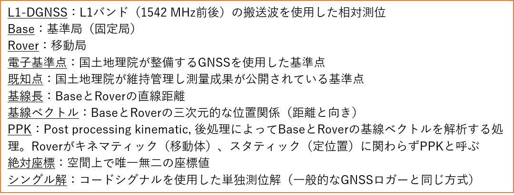
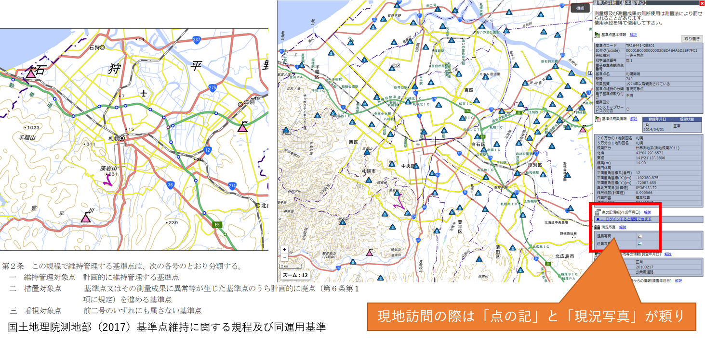
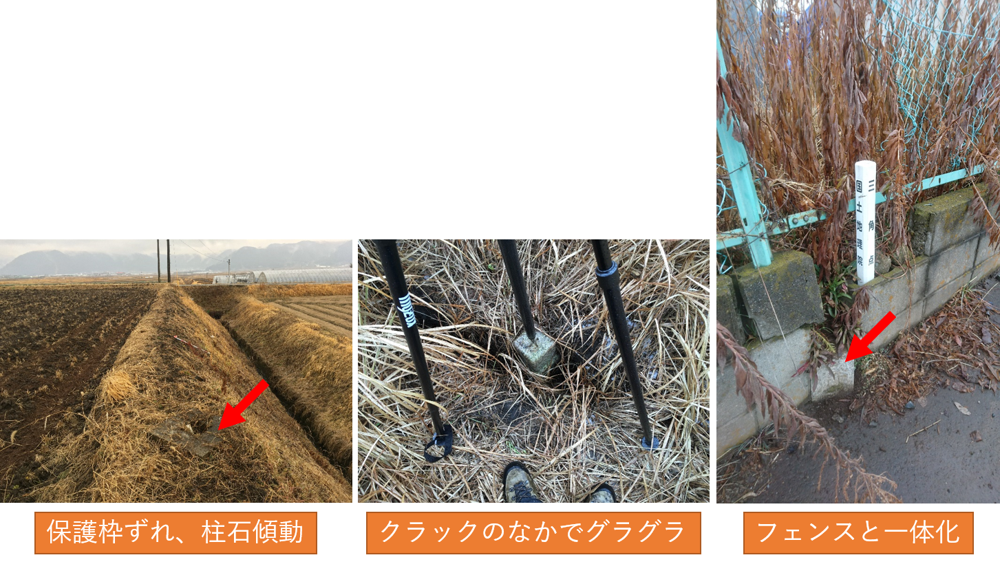
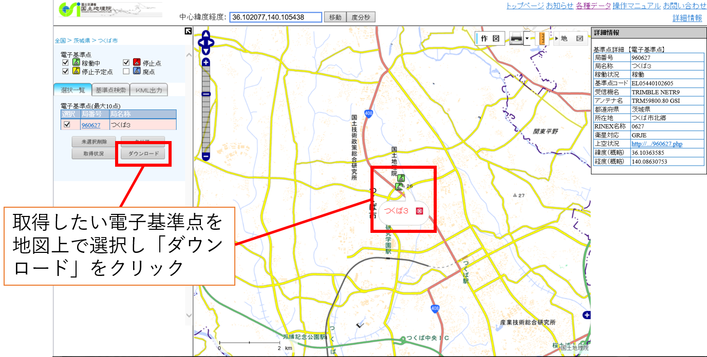
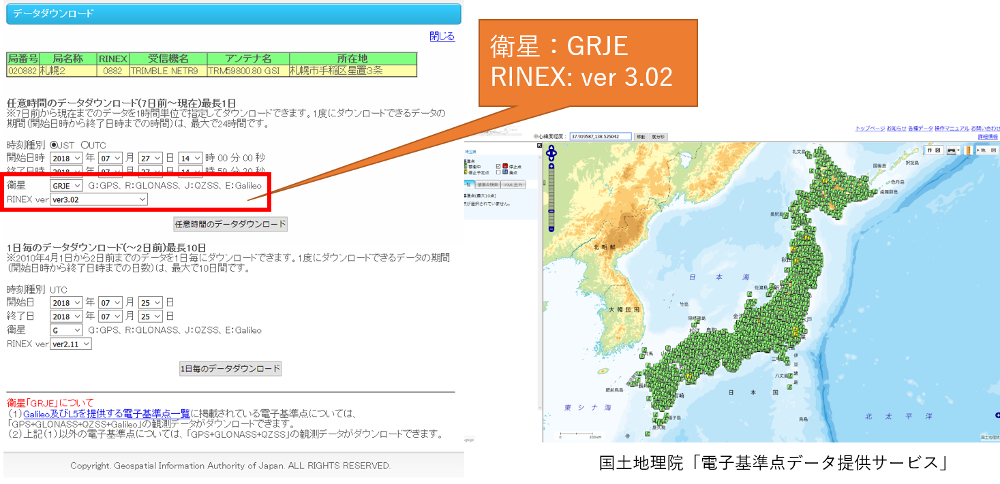
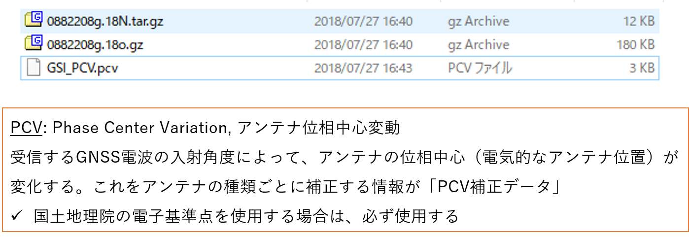
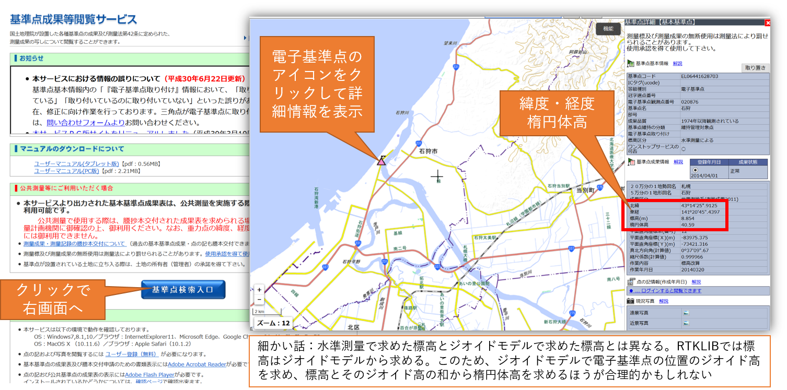

# 1.計画
**"成功は（失敗は）その時点で約束されている"**

## はじめに

GNSSで観測したBaseとRoverのデータを使って、RTKLIBでは何をしているのか？  
- 基線ベクトルを求めている
  - 基線ベクトル：BaseとRoverの三次元的な位置関係（距離と向き）
  - Roverの座標は基線ベクトル解析の結果を利用して間接的に求めた値

- Roverの座標を得るまでプロセス
1. BaseからRoverまでの基線ベクトルを求める
2. Baseの座標を原点としてRoverの座標を求める
3. ユーザーが設定した出力座標系に合わせて座標変換
4. Rover座標を解析結果（.posファイル）に出力
- BaseとRoverの位置関係（基線ベクトル）は、Base座標に関わらず一定。すなわち、Base座標に誤差（位置ズレ）があれば、Roverの座標も同じ位置ズレを持った値になる
- Roverの絶対座標を得ようとする場合、Baseの絶対座標を求める必要がある
  - Baseの絶対座標：正確には、Baseのアンテナ位相中心の座標（Baseを設置した地面の座標ではない）

## 基本用語

## 計画

### Base設置場所の検討
- 開空率：物理的に空が開けていること。観測期間中の衛星が多く飛来する方角を確認する
- GDOP（次ページ）：観測期間中の衛星配置の状況を確認する
- [GNSS Radar](http://www.taroz.net/GNSS-Radar.html)

### Baseの絶対座標を得る方法の選択`【重要】Base座標にかかわらず基線ベクトルは一定`
1. 既知点上に設置する（Base座標を計測により求める作業は不要）
2. 電子基準点からPPKでBase座標を求める（電子基準点をBase、ユーザーBaseをRoverとしてPPK解析）
3. 既知点をRoverで計測し、Base座標を逆算する
4. Baseの精密な絶対座標は不要（Base座標としてシングル解（一般的なGNSSロガーと同じ）を使用）

### 電子基準点・既知点の選択
1. 近隣の電子基準点と基線長の確認（複数の地点を確認）
2. 近隣の既知点と基線長の確認（複数の地点を確認。維持管理対象点または看視対象点を選択）
- 国土地理院 [「基準点成果等閲覧サービス」](https://sokuseikagis1.gsi.go.jp/top.html)

### 既知点は予備も含めて選択する
**既知点は必ずしも利用できるわけではない（「点の記情報」を熟読）**
- 計測できない理由は無限にある。予備地点をいくつか用意する
- 保護枠が移動し柱石が傾いていたり
- 柱石の設置状態が不安定化していたり
- 周囲に高い木や建物があったり（GNSS電波の受信障害）
- 構造物の中に取り込まれていたり（どうやって測るの・・・）
- 植生や落ち葉や土砂に深く埋積していたり（まずは掃除から・・・）
- 存在しなかったり... etc.

### 電子基準点データの使用
**Baseの座標を電子基準点で求める場合**
1. 電子基準点RINEXファイルを入手
  - 国土地理院[「電子基準点データ提供サービス」Webサイト](http://terras.gsi.go.jp/)
  - 「国土地理院共通ログイン管理システム」ユーザー登録が必須
  - Webブラウザ版とFTP版のアカウントは別

  - tar, gz圧縮されたままでRTKLIBで使用可能
  - 「一日毎のデータ」は2日後からダウンロード可能

**PCV補正データ（GSI_PCV.TXT）のダウンロード**

- RTKLIBでは、拡張子を「.pcv」に変更しておくとスムーズに認識される

2. 電子基準点の測量成果（座標値）を調べる
  - 国土地理院[「基準点成果等閲覧サービス」](
https://sokuseikagis1.gsi.go.jp/top.html)
  - RTKLIBの解析に必要な座標値は経緯度と楕円体高（標高ではない）
  - 国土地理院[「ジオイド高計算」](https://vldb.gsi.go.jp/sokuchi/surveycalc/geoid/calcgh/calcframe.html)
  - RTKLIBの解析に必要な座標値は経緯度と**楕円体高**（標高ではない）

 `以前の資料をご覧の方へ`**「日々の座標値（F3）」は使用しないでください**

