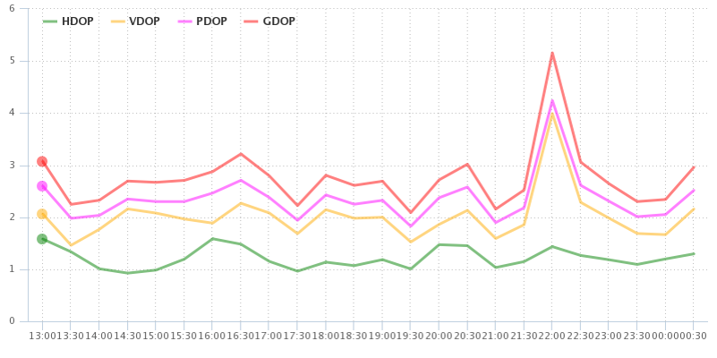

# 1.計画
**"成功は（失敗は）その時点で約束されている"**

## はじめに

---

GNSSで観測したBaseとRoverのデータを使って、RTKLIBでは何をしているのか？  
- 基線ベクトルを求めている
  - 基線ベクトル：BaseとRoverの三次元的な位置関係（距離と向き）
  - Roverの座標は基線ベクトル解析の結果を利用して間接的に求めた値

- Roverの座標を得るまでプロセス
1. BaseからRoverまでの基線ベクトルを求める
2. Baseの座標を原点としてRoverの座標を求める
3. ユーザーが設定した出力座標系に合わせて座標変換
4. Rover座標を解析結果（.posファイル）に出力
- BaseとRoverの位置関係（基線ベクトル）は、Base座標に関わらず一定。すなわち、Base座標に誤差（位置ズレ）があれば、Roverの座標も同じ位置ズレを持った値になる
- Roverの絶対座標を得ようとする場合、Baseの絶対座標を求める必要がある
  - Baseの絶対座標：正確には、Baseのアンテナ位相中心の座標（Baseを設置した地面の座標ではない）

## 基本用語

## 計画

---

### Base設置場所の検討
  - 開空率：物理的に空が開けていること。観測期間中の衛星が多く飛来する方角を確認する
  - GDOP（次ページ）：観測期間中の衛星配置の状況を確認する
  - [GNSS Radar](http://www.taroz.net/GNSS-Radar.html)

### Baseの絶対座標を得る方法の選択`【重要】Base座標にかかわらず基線ベクトルは一定`
  1. 既知点上に設置する（Base座標を計測により求める作業は不要）
  2. 電子基準点からPPKでBase座標を求める（電子基準点をBase、ユーザーBaseをRoverとしてPPK解析）
  3. 既知点をRoverで計測し、Base座標を逆算する
  4. Baseの精密な絶対座標は不要（Base座標としてシングル解（一般的なGNSSロガーと同じ）を使用）

### 電子基準点・既知点の選択
  1. 近隣の電子基準点と基線長の確認（複数の地点を確認）
  2. 近隣の既知点と基線長の確認（複数の地点を確認。維持管理対象点または看視対象点を選択）
