# 3. 解析
**“Fixしない？衛星を減らしてみたら？“**

---

## L1-DGNSSとRTKLIBによるPPK解析

### 解析のフローチャート

**解析（屋内作業）**
1. Base/Rover受信機からUBXファイルをダウンロード
    - uBlox社の受信機を使用した場合
2. RTKCONVでUBXをRINEXファイルに変換
    - 電子基準点に合わせてRINEX ver.3.02を使用
3. RTKPOSTでRoverの座標を求める
    - 定位置を計測した場合の測位モードはStaticを使用
    - Baseの座標が未知の場合：Roverの座標は相対値
    - Baseの座標が既知の場合：Roverの座標は絶対値
4. Roverの座標を得る
    - 解析結果（.pos）のテキストファイルを参照
    - Fix解の場合：Ratio = 999.9となった最終行の座標
    - Float解の場合：Ratioが最も高い行の座標

**事前準備（ダウンロードする）**
1. [RTKLIB](https://github.com/tomojitakasu/RTKLIB)（RTKCONVやRTKPOSTなどの解析ソフトウェア群。最新版はrtklib 2.4.2 p13）
2. [GSIGEO2011](http://www.gsi.go.jp/buturisokuchi/geoid_model.html)（ジオイドモデル）
    - 最新版は「日本のジオイド2011」(Ver.2) , ただしRTKLIB 2.4.2では日本全域に対応していない（正常動作しない地域がある）

### 基本用語集

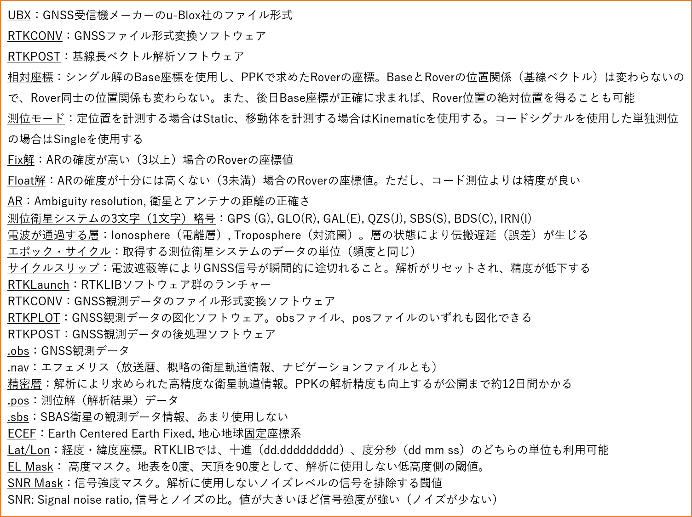

## 事前準備

### RTKLIBのダウンロード
最新版のソースコード  
[https://github.com/tomojitakasu](https://github.com/tomojitakasu)
  - ソースコードを読むとマニュアルにない機能の意味がわかる（時もある）
  - 現在はgithubで最新版の開発・公開が行われているもよう

最新版のバイナリ（開発者ではない人はこちら）
[https://github.com/tomojitakasu/RTKLIB_bin](https://github.com/tomojitakasu/RTKLIB_bin)
  - WindowsのGUIで使用するならバイナリ（exeファイル）を使用する
  - binフォルダ全体をダウンロード

## RTKLIBの動作確認
**RTKLIBが動かない場合**  
講習会などでよくある現象

- Executeをクリックしても処理ができない、エラー終了する  
→ 「管理者として実行」する

- 処理は開始されるが、ファイルが出力されない  
→ダウンロードするバージョンを変えてみる

- どうしても処理ができない（正しく動かない）  
→正常動作している人のバイナリファイルのコピーをもらう

## GSIGEO2011のダウンロード
- [最新版「日本のジオイド2011」(Ver.2)]( http://www.gsi.go.jp/buturisokuchi/geoid_model.html
)    
  RTKLIB 2.4.2は最新のジオイドモデルに対応していない（正常動作しない地域がある）

- [国土地理院「ジオイド高計算」](https://vldb.gsi.go.jp/sokuchi/surveycalc/geoid/calcgh/calcframe.html)  
RTKLIBでは楕円体高で計算し、このWebサイトでジオイドを求めてもよい

- [国土地理院「基盤地図情報ダウンロードサービス」](https://fgd.gsi.go.jp/download/menu.php
)  
  - 使用するファイル：gsigeo2011_ver2.asc
  - RTKLIB 2.4.2は最新のジオイドモデルに対応していない（正常動作しない地域がある）

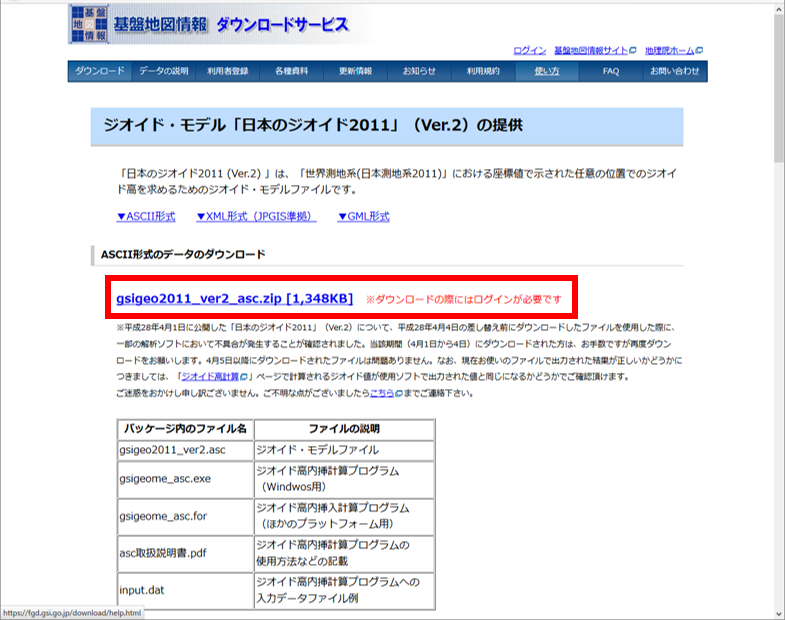

## 観測データのダウンロード

### Base/Rover受信機から観測データをダウンロード
**観測データ（UBXファイル）のダウンロード**
- EMLID Reach RS / Reach RTKの例
- 受信機にWi-Fi接続し、観測データをダウンロード

## RINEX変換

### RTKCONVでUBXをRINEXファイルに変換
- 電子基準点に合わせてRINEX ver.3.02を使用
- RTKLIBの解析ではRINEX形式のデータを使用する  
- Reach RS / Reach RTKではu-blox社のネイティブファイル（.ubx）形式で保存される
- RTKCONVは各社のネイティブファイルをRINEXに変換するツール
  - 一部のメーカーの観測データは変換できない（ファイル仕様が公開されていない）
- 変換元ファイル名にアスタリスク「 * 」を使用すると、連続しているが分割されて生成された複数ファイルを一つのRINEXファイルに変換可能
開始・終了の年月日時分秒を指定すると、その期間のRINEXファイルを出力することもできる（動作が軽くなる）

**RTKCONV（RTKLIB/bin/rtkconv.exe）**

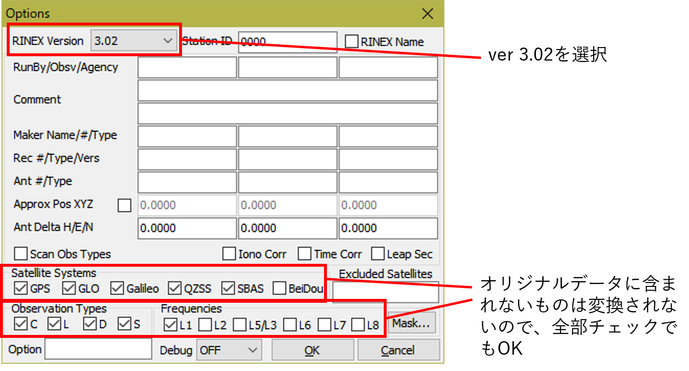

## PPK解析　～解析の基本手順をBaseの絶対座標を使用しない例で示す～

### RTKPOSTでRoverの座標を求める
**RTKPOST（RTKLIB/bin/rtkpost.exe）**
- rtkpost.exe: 一般的にはこちらを使用
- rtkpost_mkl.exe: インテル® マス・カーネル・ライブラリーが利用可能な環境の場合

- 初めてRTKPOSTを使用する時のみ、以下の操作を最初に行う
1. Options画面の”Positioning Mode”を”Static”に変更
  - Static: 定位置の地点を観測する場合
  - Kinematic: 移動体を観測する場合
2. “OK”をクリックしてOptions画面を閉じる

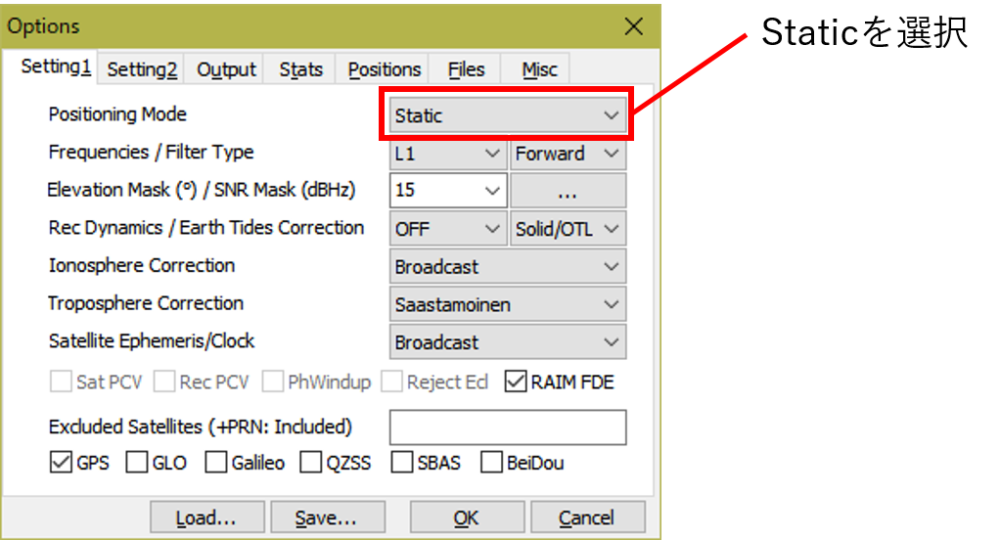

- Base/Roverの観測データ（RINEXファイル）を設定する
- Base/Roverの各ファイルを設定する欄に注意
- Options画面で”Static”に設定していない場合、Baseファイルを設定できない

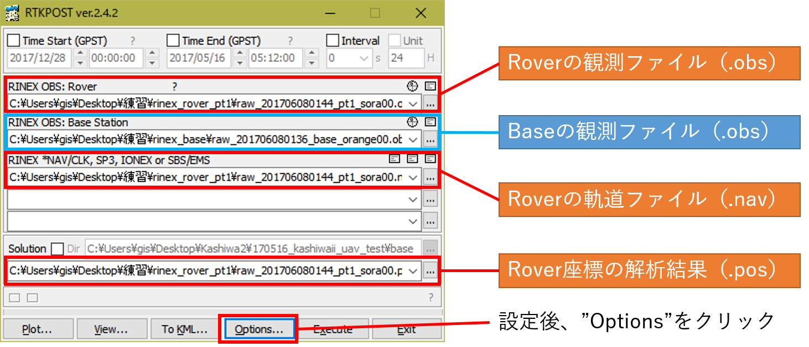

Options “Setting1”の設定

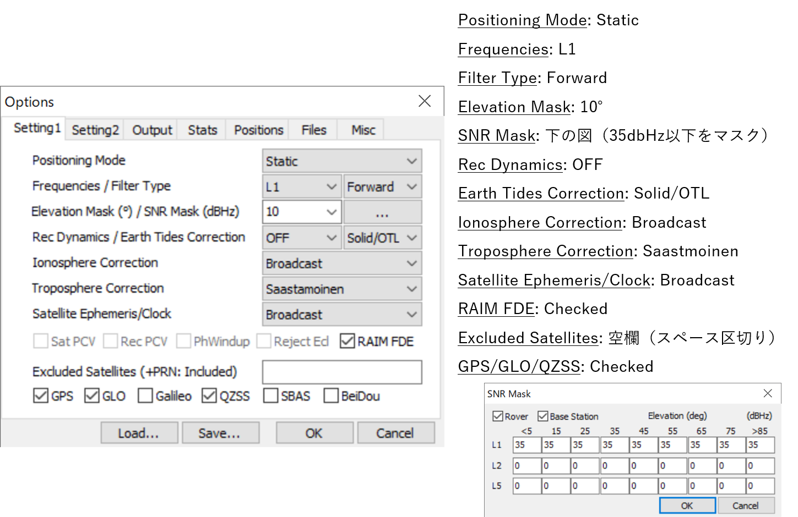

Options “Setting2”の設定

Options “Output”の設定

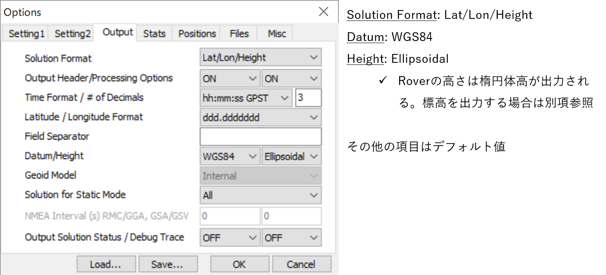

Options “Positions”の設定

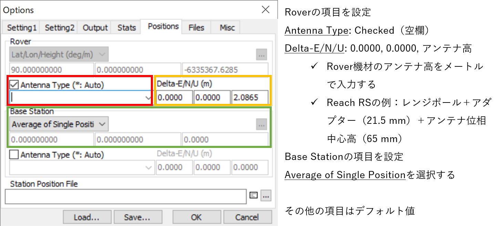

Options “Stats”, “Files”, “Misc”の設定
- すべてデフォルト
- 空欄にすべきところは空欄であることを確認する

1. Base/Roverの観測データ（RINEXファイル）を設定しましたか？
2. Optionsのすべてのタブの設定項目が適切であることを確認しましたか？
- Optionsは以前の設定値を記憶しているため、**解析のたびに確認が必要**

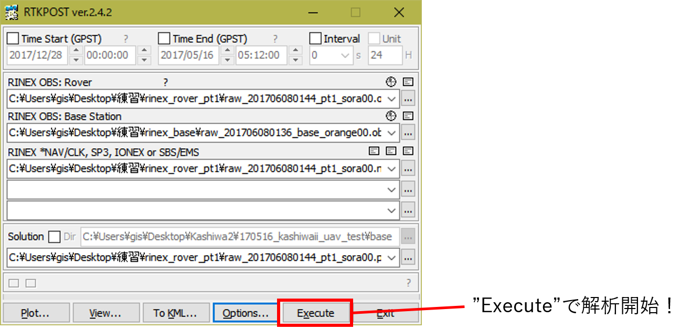

**【参考1】Roverの「標高」を出力する：RTKPOSTにGSIGEO2011を設定する**

1. “Options”を開いて
2. “Files”タブの”Geoid Data File”にgsigeo2011_ver2.ascを指定（左図）
3. “Output”タブの”Datum / Height”で”Geodetic”を指定（右図）
4. 同タブの”Geoid Model”で“GSI2000 (1x1.5”）“を指定（右図）
- RTKLIB 2.4.2は最新のジオイドモデルに対応していない（正常動作しない地域がある）

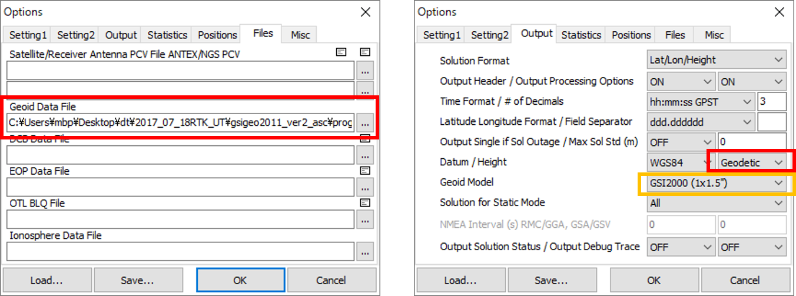

**【参考2】電子基準点データの使用：RTKPOSTに座標とPCV補正ファイルを設定する**

1. “Options”を開いて
2. “Files”タブの”Receiver Antenna PCV File”にGSI_PCV.pcv（または.TXT）を指定（左図）
  - 受信機のアンテナファイルは2行目に指定する。 1行目は衛星のアンテナファイルを指定する欄
3. “Positions”タブの”Base Station”に電子基準点の座標＋楕円体高を入力（右図）
4. 同タブのBase Stationの”Antenna Type”に「 * 」（自動選択）を入力（右図）

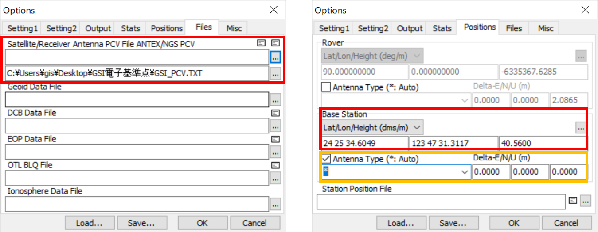

**【参考3】Baseの絶対座標の使用：RTKPOSTにBase座標を設定する**

1. “Options”を開いて
2. “Positions”タブの”Base Station”にBaseの絶対座標＋楕円体高を入力
  - dmsで入力する場合、度分秒の数値を半角スペースで区切る
3. 同タブのBase Stationの”Antenna Type”のチェックを外す
  - PPK解析では、Baseアンテナ位相中心の位置からRoverまでの基線ベクトルを求めるため、Baseのアンテナ高の入力は不要。入力すると「アンテナを設置した地面」の高さを意味する。そこじゃない。

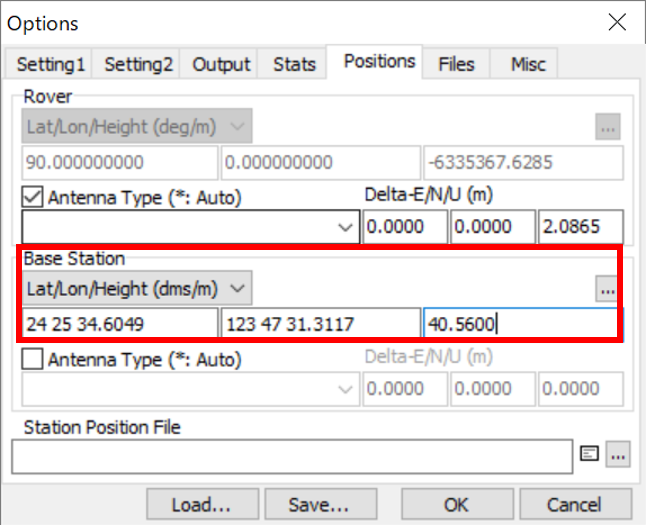

## 成果出力

### Roverの座標を出力する
- 解析結果（.pos）のテキストファイルを参照
- Fix解の場合：Ratio = 999.9となった最終行の座標
- Float解の場合：Ratioが最も高い行の座標

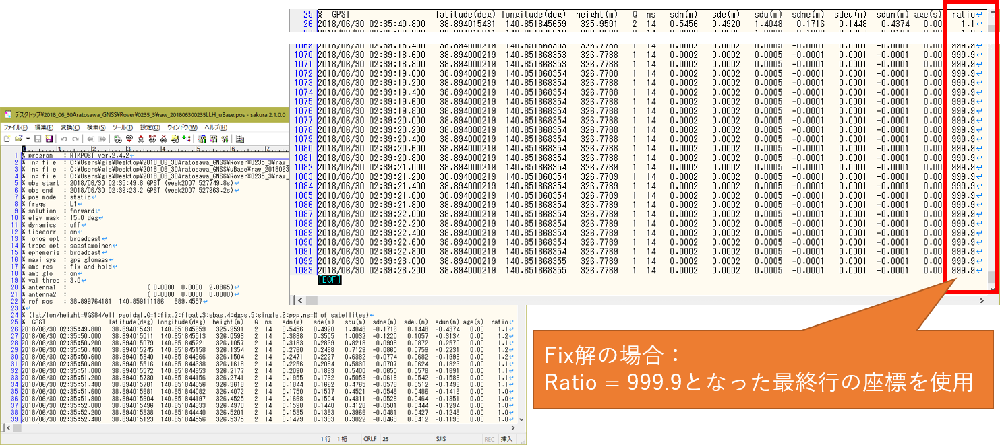

## ノウハウ
**【解説1】RTKPLOT**
- GNSS観測データ（.obs）と解析結果（.pos）を図化するソフトウェア
- 観測データの図化：受信衛星の数と品質（高度、SNR、マルチパス）の評価
- 解析結果の図化：解の品質（Grd Trk, Position, AR）の評価

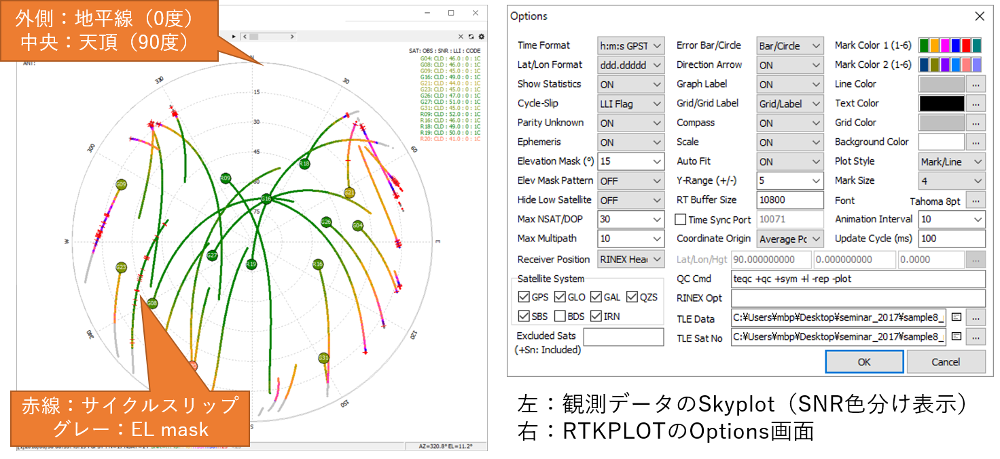

**GNSS観測データ（.obs）の図化：BaseとRover両方の観測データについて評価する**

- 受信衛星の数と品質（高度、SNR、マルチパス）の評価
- 左の例は全体的にSNRが低く（35dbHz以下）、Fix解は得られないかもしれない
- 右の例は受信状態が良いが、G20, J01のSNRが低く、解析から除外したほうが良いかもしれない

**解析結果の図化（.pos）の図化**

- 解の品質（Grd Trk, Position, AR）の評価
- 下の図は同じ解析結果を図化したもの。観測期間の全エポックでFix解が得られている
- 左はPosition図。E-W, N-S, U-D（XYZ）各軸の位置の変動を見る。いずれも±5 mm以内であり、良好
- 中はGrd Trk図。マスの目盛は1 mm。グレーの円はエラーサークルで、時間の経過とともに小さくなっている。南北8 mm、東西5 mmの範囲にすべての解が収まっている
- 右の図はRatio Factor for AR Validation図。Ratio Factorの最大値は1,000。解析期間中のほとんどのエポックで1,000を示し、変動も少ない。安定した測位解が得られている

- 解の品質（Grd Trk, Position, AR）の評価
- 下の図は同じ解析結果を図化したもの。観測期間の前半がFloat、後半がFix解となった
- 左はPosition図。Float解（オレンジ色）の水平方向は1 m、垂直方向は4 mの変動がみられる
- 中はGrd Trk図。マスの目盛は20 cm。エラーサークルは時間の経過とともに小さくなり、Float解は南北1.6 m、東西1 mの範囲に収まる。Fix解は中央左下の1点に収束している
- 右の図はRatio Factor for AR Validation図。Ratio Factorはゆっくりと上昇するが、最大値の1,000に達した後は安定している

**【解説2】L1-DGNSS測量と解析のポイント**

- **計画**
  - 同じ測位衛星システム内で5つ以上の衛星を、良いSNRで受信が継続できること
  - 受信環境が最も良好で安定した場所にBaseを配置する。建物の屋上がベスト。車の屋根の上も可
  - Baseの周辺は立ち入り禁止。サイクルスリップや振動による精度劣化が生じる
  - 基線長を小さくする（Baseを観測領域の中央に置く）
  - 雨天や濃霧など、BaseとRoverの上空の大気状態が異なると誤差も増加する（二重差による誤差要因の相殺ができない）。基線長のZ方向の差が大きい場合も同様。長期観測ではそうした影響も考慮し、気象データを用いた対流圏遅延補正を行う必要がある（中島・他、2018）
- **測量**
  - アンテナ高は2 m以上とする（人間や植生による電波遮蔽の低減）
  - Roverは過酷な自然環境の中でも丁寧に作業できる人が担当する
設置精度を最大限に高める（NG：石突の位置ズレ、ポールの傾き、計測中の揺れ）
  - 揺れは厳禁（地球は自転し、公転し、衛星も地球を周回する。計測中の僅かの揺れでも悪影響がある）
  - 高さのあるものから可能な限り離れて計測する（電波遮蔽軽減）
アンテナを直接、地面に置いて計測しない（電波遮蔽の元凶）
- **解析**
  - 低高度でもSNRが高い場合は解析に使用する
  - 植生の葉っぱは電波を通すが、SNRを低下させる
  - SNRが低い、SNRが低い状態で安定しない、サイクルスリップがある衛星は除外する
  - 観測期間の途中で登場する衛星は、除外したほうが良い場合もある（ARがリセットされる）
  - パラメータをいじって無理やりFixさせない（衛星の除外を除き全Roverを同じ条件で解析する）
