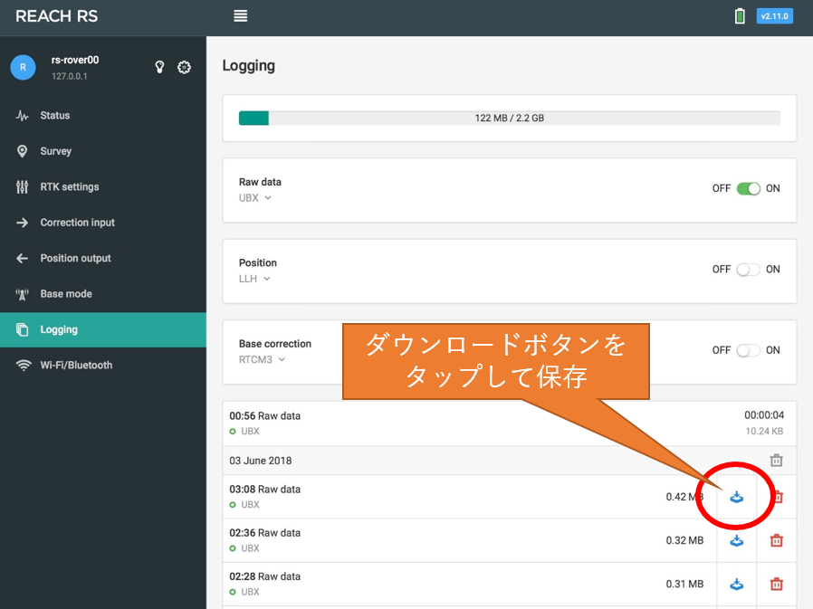
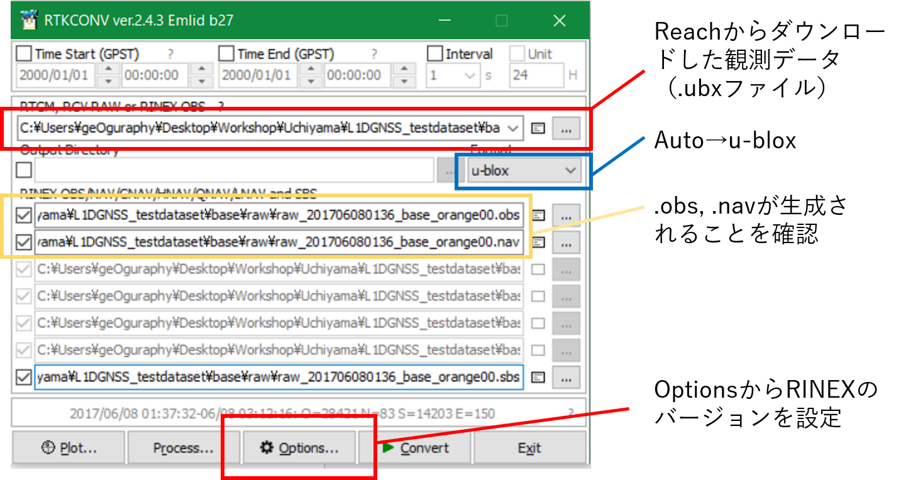
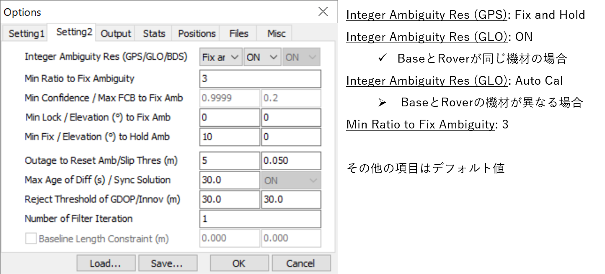

# 3. 解析
**“Fixしない？衛星を減らしてみたら？“**

---

## L1-DGNSSとRTKLIBによるPPK解析

### 解析のフローチャート

**解析（屋内作業）**
1. Base/Rover受信機からUBXファイルをダウンロード
    - uBlox社の受信機を使用した場合
2. RTKCONVでUBXをRINEXファイルに変換
    - 電子基準点に合わせてRINEX ver.3.02を使用
3. RTKPOSTでRoverの座標を求める
    - 定位置を計測した場合の測位モードはStaticを使用
    - Baseの座標が未知の場合：Roverの座標は相対値
    - Baseの座標が既知の場合：Roverの座標は絶対値
4. Roverの座標を得る
    - 解析結果（.pos）のテキストファイルを参照
    - Fix解の場合：Ratio = 999.9となった最終行の座標
    - Float解の場合：Ratioが最も高い行の座標

**事前準備（ダウンロードする）**
1. [RTKLIB](https://github.com/tomojitakasu/RTKLIB)（RTKCONVやRTKPOSTなどの解析ソフトウェア群。最新版はrtklib 2.4.2 p13）
2. [GSIGEO2011](http://www.gsi.go.jp/buturisokuchi/geoid_model.html)（ジオイドモデル）
    - 最新版は「日本のジオイド2011」(Ver.2) , ただしRTKLIB 2.4.2では日本全域に対応していない（正常動作しない地域がある）

### 基本用語集

## 事前準備

### RTKLIBのダウンロード
最新版のソースコード  
[https://github.com/tomojitakasu](https://github.com/tomojitakasu)
  - ソースコードを読むとマニュアルにない機能の意味がわかる（時もある）
  - 現在はgithubで最新版の開発・公開が行われているもよう

最新版のバイナリ（開発者ではない人はこちら）
[https://github.com/tomojitakasu/RTKLIB_bin](https://github.com/tomojitakasu/RTKLIB_bin)
  - WindowsのGUIで使用するならバイナリ（exeファイル）を使用する
  - binフォルダ全体をダウンロード

## RTKLIBの動作確認
**RTKLIBが動かない場合**  
講習会などでよくある現象

- Executeをクリックしても処理ができない、エラー終了する  
→ 「管理者として実行」する

- 処理は開始されるが、ファイルが出力されない  
→ダウンロードするバージョンを変えてみる

- どうしても処理ができない（正しく動かない）  
→正常動作している人のバイナリファイルのコピーをもらう

## GSIGEO2011のダウンロード
- [最新版「日本のジオイド2011」(Ver.2)]( http://www.gsi.go.jp/buturisokuchi/geoid_model.html
)    
  RTKLIB 2.4.2は最新のジオイドモデルに対応していない（正常動作しない地域がある）

- [国土地理院「ジオイド高計算」](https://vldb.gsi.go.jp/sokuchi/surveycalc/geoid/calcgh/calcframe.html)  
RTKLIBでは楕円体高で計算し、このWebサイトでジオイドを求めてもよい

- [国土地理院「基盤地図情報ダウンロードサービス」](https://fgd.gsi.go.jp/download/menu.php
)  
  - 使用するファイル：gsigeo2011_ver2.asc
  - RTKLIB 2.4.2は最新のジオイドモデルに対応していない（正常動作しない地域がある）

## 観測データのダウンロード

### Base/Rover受信機から観測データをダウンロード
**観測データ（UBXファイル）のダウンロード**
- EMLID Reach RS / Reach RTKの例
- 受信機にWi-Fi接続し、観測データをダウンロード

## RINEX変換

### RTKCONVでUBXをRINEXファイルに変換
- 電子基準点に合わせてRINEX ver.3.02を使用
- RTKLIBの解析ではRINEX形式のデータを使用する  
- Reach RS / Reach RTKではu-blox社のネイティブファイル（.ubx）形式で保存される
- RTKCONVは各社のネイティブファイルをRINEXに変換するツール
  - 一部のメーカーの観測データは変換できない（ファイル仕様が公開されていない）
- 変換元ファイル名にアスタリスク「 * 」を使用すると、連続しているが分割されて生成された複数ファイルを一つのRINEXファイルに変換可能
開始・終了の年月日時分秒を指定すると、その期間のRINEXファイルを出力することもできる（動作が軽くなる）

**RTKCONV（RTKLIB/bin/rtkconv.exe）**

## PPK解析　～解析の基本手順をBaseの絶対座標を使用しない例で示す～

### RTKPOSTでRoverの座標を求める
**RTKPOST（RTKLIB/bin/rtkpost.exe）**
- rtkpost.exe: 一般的にはこちらを使用
- rtkpost_mkl.exe: インテル® マス・カーネル・ライブラリーが利用可能な環境の場合

- 初めてRTKPOSTを使用する時のみ、以下の操作を最初に行う
1. Options画面の”Positioning Mode”を”Static”に変更
  - Static: 定位置の地点を観測する場合
  - Kinematic: 移動体を観測する場合
2. “OK”をクリックしてOptions画面を閉じる

- Base/Roverの観測データ（RINEXファイル）を設定する
- Base/Roverの各ファイルを設定する欄に注意
- Options画面で”Static”に設定していない場合、Baseファイルを設定できない

Options “Setting1”の設定

Options “Setting2”の設定

Options “Output”の設定

Options “Positions”の設定

Options “Stats”, “Files”, “Misc”の設定
- すべてデフォルト
- 空欄にすべきところは空欄であることを確認する

