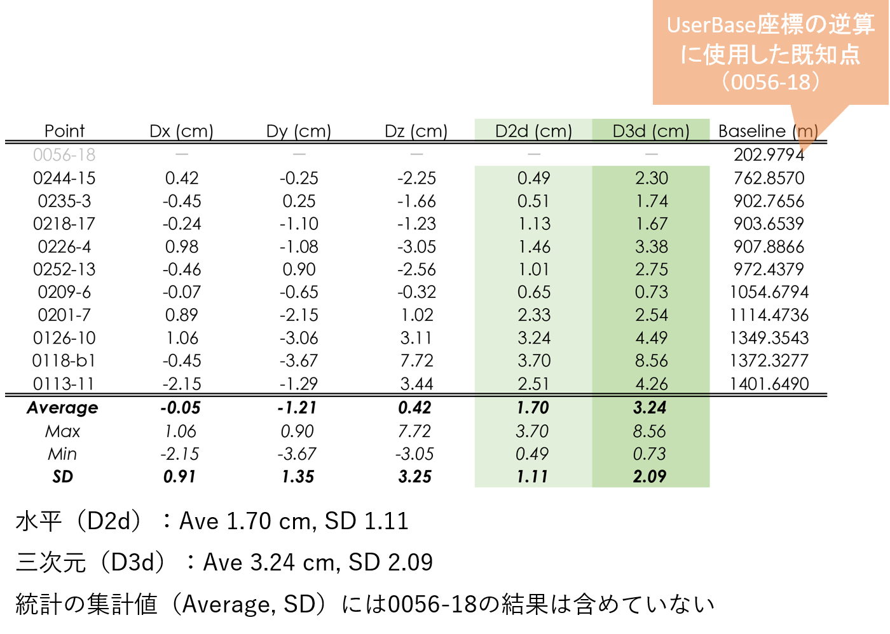
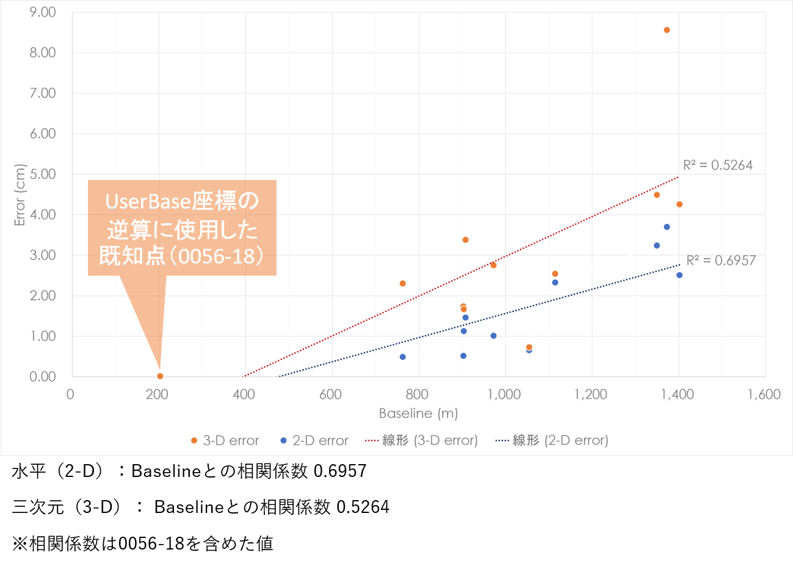
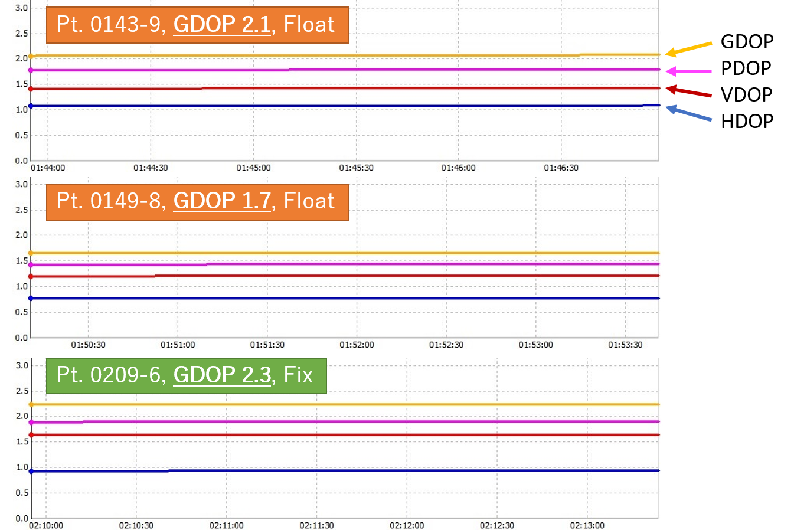
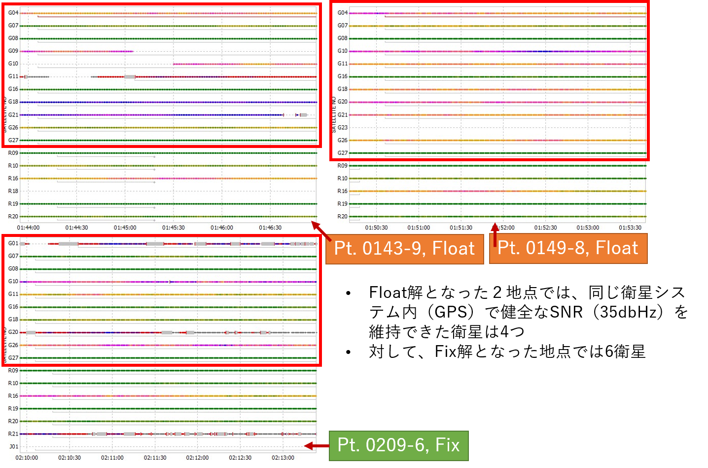
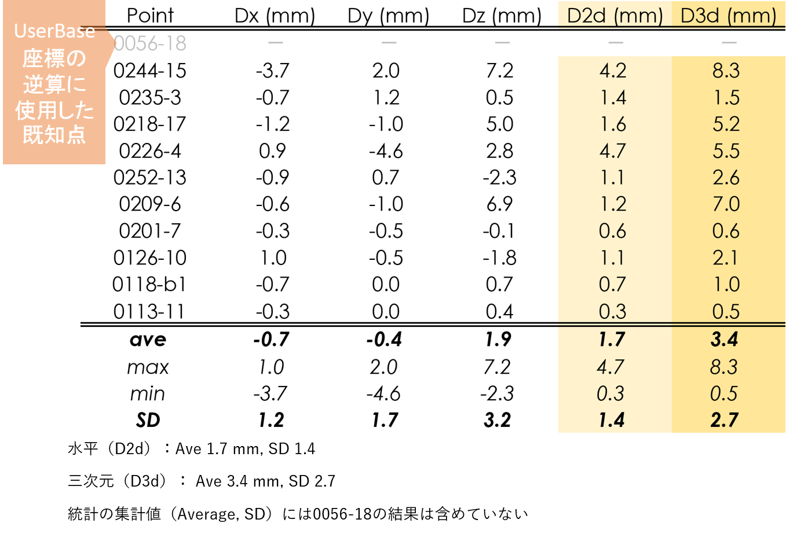
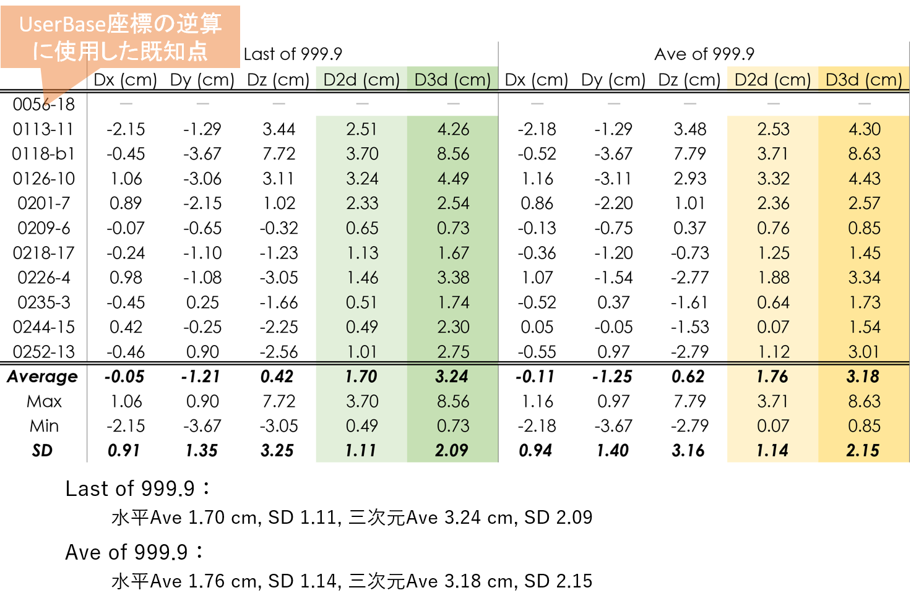
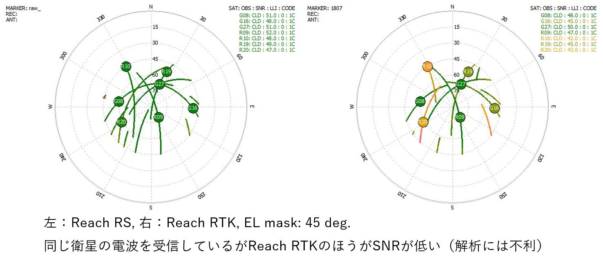

# 4.L1-DGNSS精度検証～既知点との比較による～
**結論：基線長が短く、ノイズが少なければよい**

## 場所

- 東北地方の飛行機から見える大きな地すべり地形
  - 計測地点間の最大標高差 202.4 m, 最長Baseline 1.4 km
- Base: 1点（座標未知点）
- Rover: 14地点（座標既知点）
- Rover仕様：EMLID Reach RS
  - 機器の公称精度：水平 5.0 mm + 1 ppm × D, 垂直 7.0 mm + 1ppm × D
  - Dの最大値 = 1,400 m, **水平 6.4 mm**, **垂直 8.4 mm**
  - アンテナ高 2.0865 m, 60分気泡管  
      - 気泡が標線円に接するとアンテナ位置が水平方向36.42 mmズレる。
      - 実際には標線円の中心位置を狙って設置する
- 座標既知点：GNSS１級測量機1周波スタティック法
  - 機器の公称精度：⽔平 3.0 mm + 0.5ppm × D, 垂直 5.0 mm + 0.5ppm × D
  - D の最大値 ＝ 1,880 m, **⽔平 3.94 mm**, **垂直 5.94 mm**

## 手法

- Rover計測時間：3分
- Rover設置方法
  - モノポール石突を既知点の杭頭の中心位置にある凹みや釘の中心にあてる
- RTKPOST解析処理
  1. Base最近隣点の既知座標からBase座標を逆算
  2. RTKPOSTで残り13点の座標を求める
- 精度検証2種
  1. 13点の座標と既知点座標との比較（Last of 999.9）
  2. Last of 999.9とAve of 999.9の比較

## 結果1：既知点との比較
- Base最近傍の既知点（1点）
- Base絶対座標の逆算に使用

- 残り13点の既知点
  - Fix 11点
  - Float 2点
  - 既知点座標エラー1点（除外）

- Fix地点のうち1点（0113-11）で最大ratioが 471.4  
  - この地点の座標値はratio 471.4のエポックを採用
  - Aveではratioが100以上のエポックを使用して平均値を計算

## 結果2：Float解となった2地点

## 結果3：Last とAveを既知点と比較.

## 考察1：L1-DGNSS精度検証

- **現時点では、最良の精度が得られれる簡易測量手法ではないか**
  - 短距離Baseline（今回は1.4 km）であれば、Fixすれば良い精度が得られる
    - 水平（D2d）：Ave 1.70 cm, SD 1.11
    - 三次元（D3d）：Ave 3.24 cm, SD 2.09
  - 三次元精度（U-D精度）はもっと良い可能性がある
    - 基準点計測時の杭頭の正確な高さ基準面が不明であった（プロは三脚を使用する）。高さのある釘が打ってあったり、十字が刻んであったり、傾いていたり、様々な状態であった
- **精度検証は何を検証しているのか：誤差＝観測誤差＋機器設置誤差＋既知点誤差**
  - 水平精度をみる限り、観測者による機器設置誤差は小さい（自画自賛。）
  - PPK-L1GNSSそのものの観測精度と、それ以外の要素（機器設置誤差、既知点誤差）との分離は難しいが、機器設置誤差は誤差全体の主要因となる可能性がある
- **Fix解を得るための指標：GDOPとSNR**
  - Float解となった地点のGDOPはFix解地点と比較しても悪くはない。しかし、全体的にSNRが低い。SNRが低くなった要因は、植生の葉による遮蔽が考えられる

## 考察2：LastとAveの比較

- **どちらを使用してもほぼ同じ結果。Last of 999.9で良いのでは**
  - LastとAveの座標の差
    - 水平（D2d）：平均1.7 mm, SD 1.4
    - 三次元（D3d）： 平均3.4 mm, SD 2.7
  - 既知点との比較
    - 水平平均 1.70 cm, SD 1.11, 三次元平均 3.24 cm, SD 2.09
    - 水平平均 1.76 cm, SD 1.14, 三次元平均 3.18 cm, SD 2.15
- メリット・デメリット  
Last of 999.9を使用する場合：  
　○一行のコピペで座標の取得が完了。作業が楽  
　×999.9の山が複数ある場合や、Positionの変化傾向が大きい場合に悩む  
Ave of 999.9を使用する場合：  
　○Positionの変化が大きくても全体の傾向に近い値が得られる（だろう）  
　×作業が面倒（posの成形、999.9の抜き出し、座標値の平均）

## Reach RS / Reach RTK

- **アンテナ利得の大きいReach RSのほうが有利**
- Reach RS: アンテナ TW2706, LNA Gain 28 db typ.
- Reach RTK: アンテナTW4721, LNA Gain 26 db min.  
　（乱暴な）単純計算ではRSのアンテナのほうが1.26倍利得が大きい

## おすすめ文献、引用文献

- おすすめ文献
  - 測位衛星技術株式会社 (2016) [GNSSの基本知識 Version 1.0.](
https://gnss.co.jp/wp-content/uploads/2016/07/ddd790b4eae745d43594c4f302b14761.pdf)  
  - 高須知二 (2013) [RTKLIB: Documents.](
http://www.rtklib.com/rtklib_document.htm)
  - [rtklibexplorer (2018) Brog.](
https://rtklibexplorer.wordpress.com/)

- 引用文献
  - 中島伸一郎・古山陽太・林佑一郎・Nguyen TRUNG KIEN・清水 則一・廣川誠一 (2018) 急傾	斜長大斜面のGPS三次元変位計測における誤差補正の効果と長期連続モニタリング結	果. 日本地すべり学会誌, Vol. 55, No.1, pp.13-24.
  - 内山庄一郎・齋藤仁 (2018)センチメートル級の地形変化抽出を目指した	地上基準点の	GNSS観測（速報）.第9回GIS-Landslide研究集会および第5回高解像度地形情報シン	ポジウム発表要旨集, pp. 28-30.
  - 内山庄一郎 (2018) 必携ドローン活用ガイド. 東京法令出版.（印刷中）
