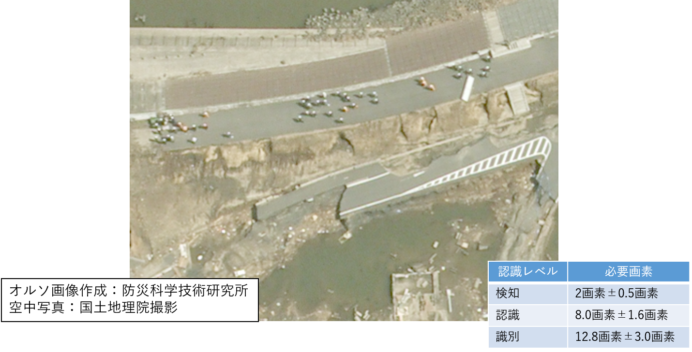
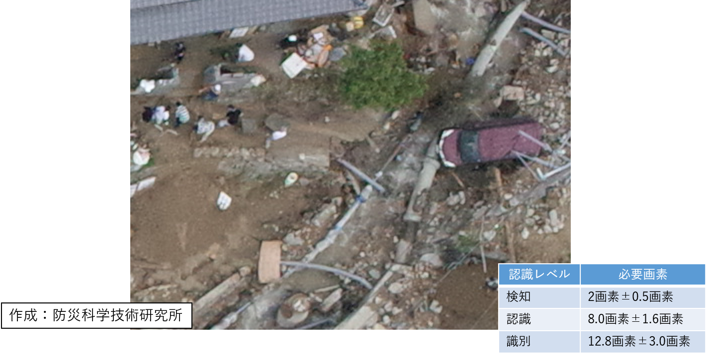
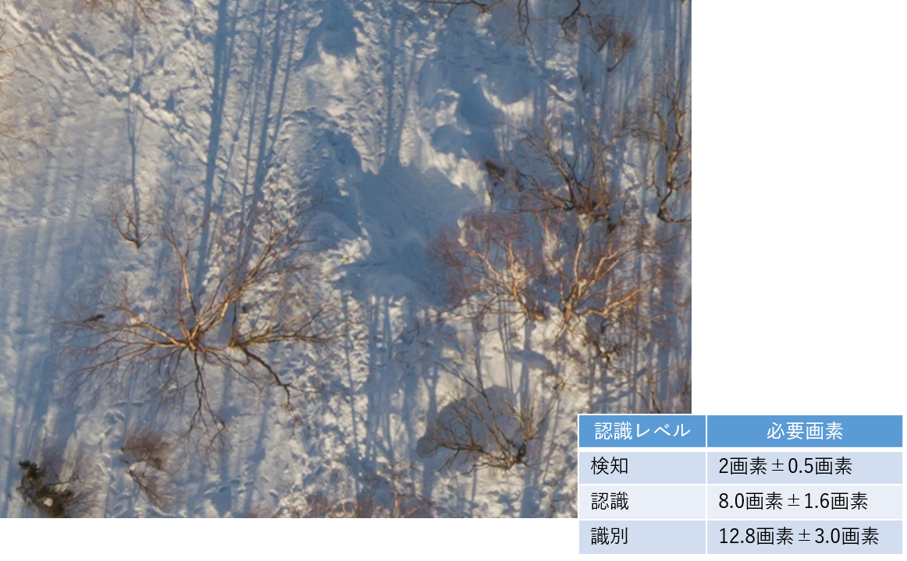

# ２. SfM解析計画基礎
**分解能を決めるには（pp.74-86）**

---

## 映像・画像判読の基礎 (pp.74-75)

映像や写真はもっとも身近な情報源の一つ
  - 眺めるだけなら、専門的な知識も訓練も不要
  - 基本的な画像判読の知識があれば、読み取れる情報の正確性や内容の信頼性は大きく向上する

## 映像・画像判読の基礎：識別レベル (p.75)

- ジョンソン基準（1958）による識別レベル
  1. 検知不可（物体を発見することができない）：－
  2. **検知**（物体が存在していることが分かる）：**2画素±0.5画素**
  3. 向き（物体の向きが分かる）：2.8画素±0.7画素
  4. **認識**（物体が何だかわかる）：**8.0画素±1.6画素**
  5. **識別**（物体の個々を区別できる）：**12.8画素±3.0画素**
  ※ターゲットとなる物体とその背景とのコントラストが大きいことを条件とする

分解能16.5 cmのオルソ画像における識別レベルの例  

上から見た人間（50 cm×30 cm: 3.0画素×1.8画素）に着目すると、「検知」と「認識」の中間レベル。周囲の状況や服装の想定を踏まえれば、人間であることを「認識」できる。しかし、もしこの中に知り合いがいたとしても、個人まで「識別」することはできない。

分解能5.0 cmのオルソ画像における識別レベルの例

この分解能では、上から見た人間（50 cm×30 cm: 10画素×6画素）は「認識」に相当する。もしターゲットとなる人物の服の特徴が分かっていれば「識別」も可能であろう。このクラスの分解能では、画面から得られる<u>情報量が大幅に増加</u>する。

## 映像・画像判読の基礎：識別レベル (p.82)

分解能3.3 cmの空中写真における識別レベルの例  

350 mlペットボトル（6 cm×15 cm: 1.8画素×4.5画素）は「検知」と「認識」の中間だが、コントラストが低いため発見は難しい。しかし、事前の情報として「緑色のラベルの緑茶」という情報があれば、それらしい地点を示すことができる。このように、コントラストが低ければ識別レベルは下がる。しかし、動く物体や、種類や色、形などの事前情報があれば識別レベルは上がる。
