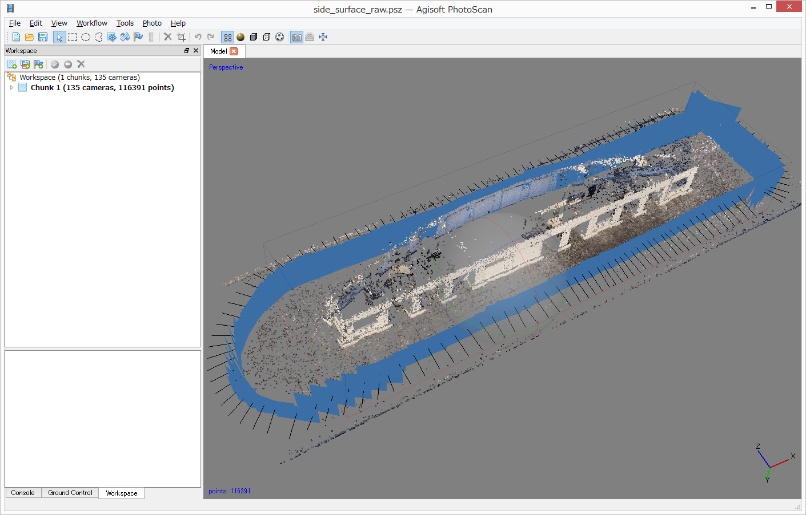
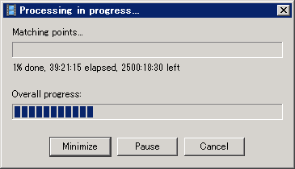

# 7. Workflow: Align Photos
　Align Photosの注意点：  
　Accuracyは通常は「High」を選択する。  
「Low」を選択すると、計算が速いが精度は荒くなる。さらに、特徴点が少ない画像の場合は「Low」で処理すると失敗する場合がある（Fig.7.1、Fig.7.2）。

  
Fig.7.1 Align Photos「Accuracy: Low」で撮影位置を推定した結果。カメラポジションの推定は不正確で、この先の処理は不可能。

  
Fig.7.1 Align Photos「Accuracy: High」で撮影位置を推定した結果。正しく整列した。

  
　Pair preselectionでは、「Reference」を使用する。通常、それ以外は使用しない。  
Reference設定は、画像のEXIFにある撮影位置情報（経緯度・高さ）を参照し、隣接写真を空間的に検索し、Tie point（画像間の共通点）の処理に用いる写真ペアを高速に決定する。なお、Referenceは、撮影位置情報が無い場合は使用できない（エラー終了する）。多くの写真に位置情報があれば、一部の写真の位置情報が無くても処理可能。  

　Disableは、読み込んだ画像すべての総当たりでペアとなる写真を検索する。写真数が増えれば、処理にかかる時間は莫大なものになる。例えば下の図。

  
　Advancedセクションでは、画像から抽出する特徴点の数（画像一枚当たり）を設定する。デフォルトではKey point limitは「40000」、Tie point limitは「4000」である。通常はこの設定で問題ない。特徴点が少ない画像（テクスチャーが少ない、平坦でのっぺりとした画像やとても古い空中写真等）は、抽出する特徴点の数を増やすと良い結果が得られる場合がある。  
　なお、「0」を設定すると、可能な限り特徴点を抽出するモードとなる。ただし、不正確な特徴点も抽出されるため、結果としてノイジーな点群となる。また、計算時間が大幅に増加する。
