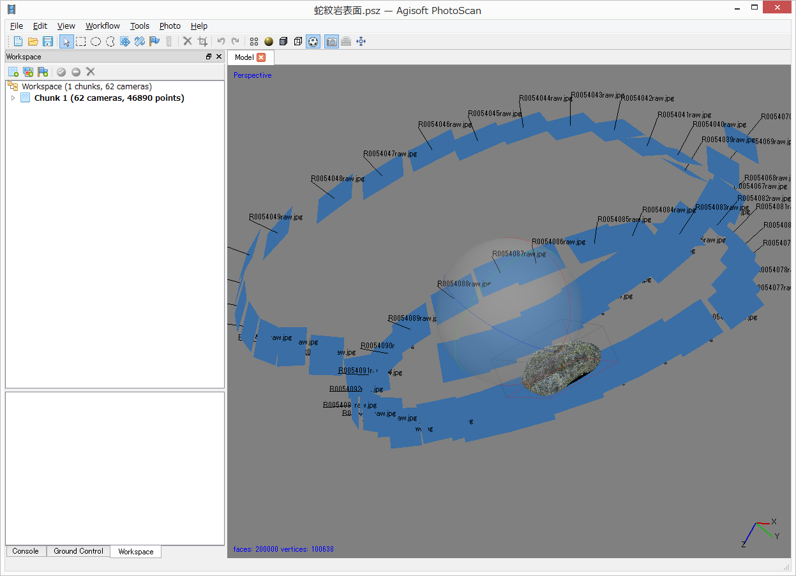
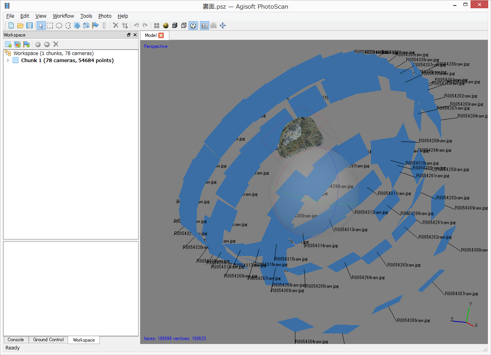
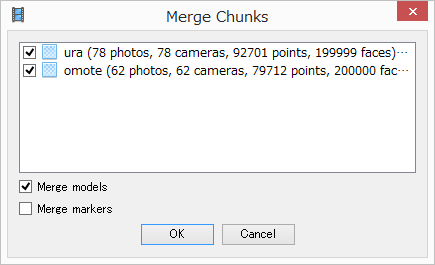
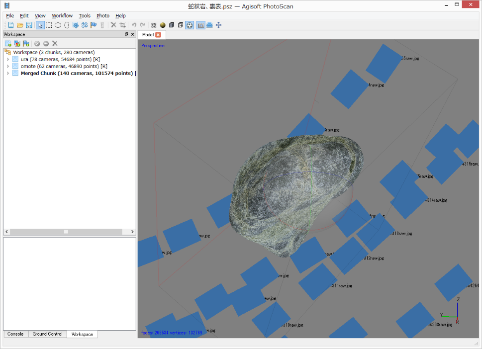

# 11 複数Chunk処理
　UAVの飛行コースが複数ある場合や、対象物を複数のパーツに分けて撮影した場合など、それぞれを個別のChunk（ひとまとまりの写真画像）に分けて処理し、後ほど合成することができる。ここでは、三次元オブジェクト（蛇紋岩の石ころ）の例で解説する。
長径約7cmの蛇紋岩の円礫を表面（Fig.11.1）と裏面（Fig.11.2）の2回に分けて撮影し、上下のパーツを合成して完全な丸い円礫の3Dモデル（Fig.11.3）を構築した。  

  
Fig.11.1 表面のモデリング。  

  
Fig.11.2 裏面のモデリング。  
それぞれの面のモデリング終了後、次の処理を行う。なお、一つのファイルでChunkを分けて処理をしても、二つのファイルに分けて処理をしても、どちらの方法でも構わない。  

  
「Workflow」-「Align Chunks」を選択する（Fig.11.3）。
Fig.11.3 Align Chunksウィンドウ。MethodはPoint basedを選択。GCPを設定している場合など、「すべてのChunkで共通のMarker名称を持つ」Markerを設定していれば、MethodでMarker basedを使用できる。同様に、共通の写真画像を使用している場合はCamera Basedでも良い。Accuracyは「High」一択で。  

Align Chunksが完了しても、PhotoScanの画面上では何も表示は変化しない。次に、「Workflow」-「Merge Chunks」を実行する。  

  
Fig.11.4 Merge Chunksウィンドウ。マージしたいChunkにチェックを入れる。Merge modelsにもチェックを入れる。MarkerもMergeしたい場合はMerge markersにもチェックを入れてOKをクリックする。
Mergeが成功するとWorkspaceに「Merged Chunk」が追加される。  

  
Fig.11.5 表面、裏面のモデルをマージして一つのモデルを生成した。  

###参考文献
---
内山庄一郎・井上　公・鈴木比奈子 (2014.02) SfMを用いた三次元モデルの生成と災害調査への活用可能性に関する研究. 防災科学技術研究所研究報告, 81, 37-60.  
[http://dil-opac.bosai.go.jp/publication/nied_report/PDF/81/81-4uchiyama.pdf](http://dil-opac.bosai.go.jp/publication/nied_report/PDF/81/81-4uchiyama.pdf)

早川裕弌・小花和宏之・齋藤　仁・内山庄一郎 (2016.07) SfM多視点ステレオ写真測量の地形学的応用. 地形, 37 (3), 321-343.  
[http://www.csis.u-tokyo.ac.jp/~hayakawa/resources/Hayakawa_etal_2016_SfMgeomor_TJGU.pdf](http://dil-opac.bosai.go.jp/publication/nied_report/PDF/81/81-4uchiyama.pdf)
