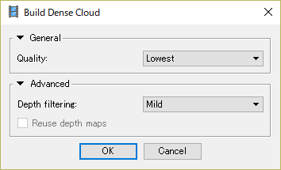
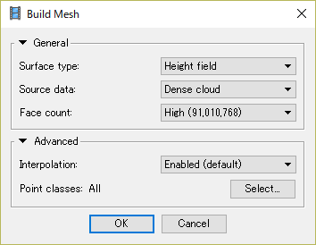
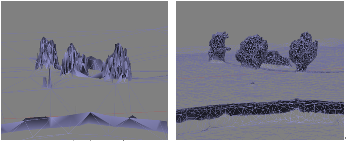
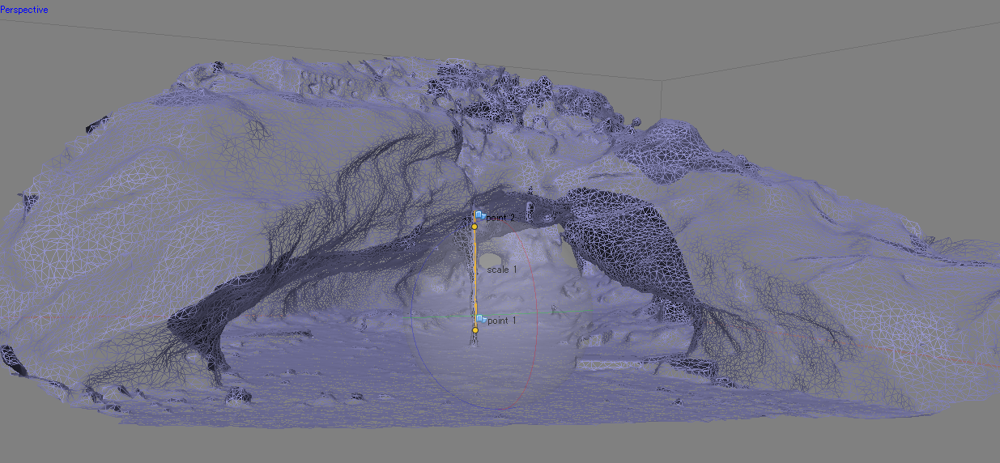
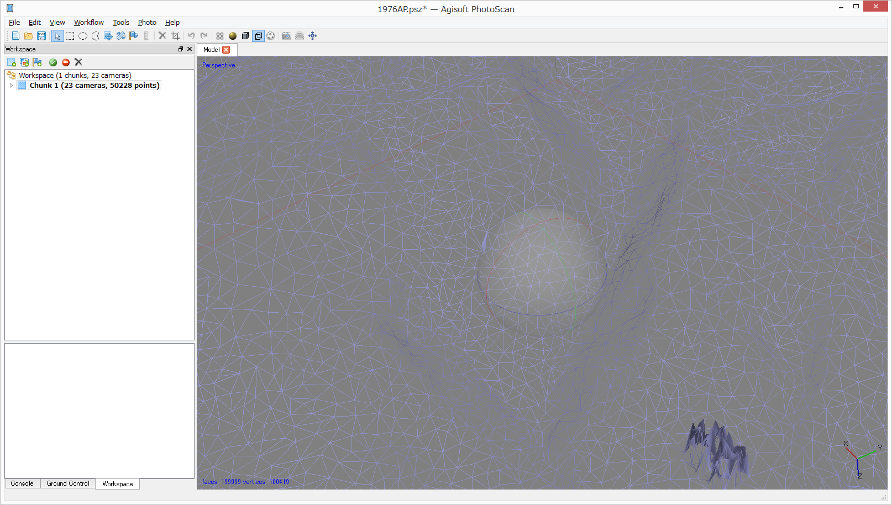
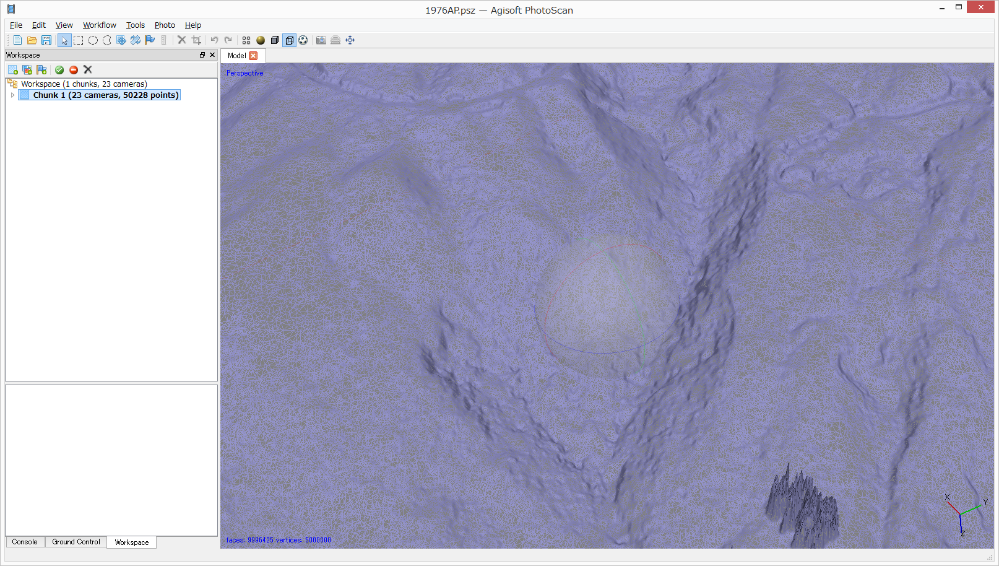
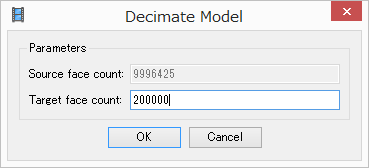

# 8a Workflow: Build dense cloud
　Build dense cloudフェーズでは、三次元の高密度点群を作成する。
　Qualityは最高がUltra high、次いでHigh, Medium, Low, 最低がLowestの5段階。Ultra highは、オリジナル写真画像の全ての画素に対してDepth mapを計算する。Qualityが下がるごとに、画像を1/4（幅と高さを半分にする）にリサイズしてDepth mapを計算する。たとえば、GSD 3cmの写真であれば、Ultra highで得られる地上解像度はGSDと同じ3cm、Highにすると6cm、Mediumなら12cm、Lowだと24cm、Lowestでは48cmになる。
処理時間は、単純に倍数で増減しない。感覚的に、Ultra highはHighの10倍以上、HighはMediumの8倍、MediumはLowの4倍、LowはLowestの３倍程度の所要時間となる。なお、オルソ画像しか使用しないのであれば、Qualityはオルソ画像の品質に対する影響が小さいため、Lowestで問題ない。

  
Fig.8a.1 Build dense cloudウィンドウ。

　Depth filteringセクションでは、Build dense point cloud処理における「外れ値」のフィルタリングの強さを設定する。ノイズの多い画像や、焦点が合っていない画像は、Dense point cloudで作成される点群の位置が、正しい位置からズレた場所に生成される原因となる。  
デフォルトは「Aggressive」でありフィルタが強く適用される。「Mild」はフィルタの適用度合いが弱い。このため、撮影対象物の表面の微細な形状も再現しうる。ただし、使用する写真の品質が悪ければ、ノイズも相応に増える。航空写真を用いて地形面の三次元モデルを作成する場合は「Mild」が良い。

# 8b Build Mesh
　Build mesh処理では、TINモデルを生成する。Surface typeは、Height fieldおよびArbitraryの2種の方式がある。これらは必要な計算時間やハードウェアリソースが大幅に異なるため、モデル化したい対象物に応じて、適切な種類を選択する必要がある。

  
Fig.8.1 Build Meshウィンドウ。Surface typeを適切に選択すること。

## Surface type: Height field  
---
垂直写真（国土地理院などの垂直写真、UAVの高解像度垂直写真も含む）から地形モデルを生成する場合に使用する。DSM、オルソフォト（正射画像）を作成するのであればこのモードを使用する。  

**ポイント：**  
- 実際には三次元モデルではなく、2.5次元モデルを生成する。
- たとえば樹木の場合、樹冠と幹を表現できない（Fig.8.2の左）。
- 計算リソース（特にメモリ）消費が少ない。32GBのメモリで200～500枚程度の写真を処理可能
- 計算時間が短い  

   　
Fig. 8.2　立ち木（3本）をモデル化。左Height field、右Arbitrary。  

## Surface type: Arbitrary  
---
建物、洞窟内部、オーバーハング露頭、人物などの完全な三次元形状を再現する場合に使用する。オルソフォトや地形図の生成には向かない。  

**ポイント：**  
- 完全な形状の三次元モデルを生成する。
- たとえば樹木の場合、樹冠と幹を区別できる。（Fig.8.2の右）。
- 露頭や岩石、石像など、小規模な対象であれば精密な立体モデルを生成できる（Fig.3.10、Fig.12.5、Fig.8.3）。
- 計算リソース（特にメモリ）消費が非常に大きい。32GBメモリの場合、現実的には100～200枚程度の写真の処理が限界
- 計算時間が非常に長い。  

  
Fig.8.3 とあるノッチの立体モデル。洞窟状に奥行きのあるモデルも生成できる。  

## Face countの設定  
---
三次元モデルの表面を構成する三角形のポリゴンの数を指定する。通常はHighで良い。Highは、Dense point cloudの1/5、Mediumは1/15、Lowは1/45となる。  

## Interpolationの選択  
---
-	Enabled：特徴点が得られず、Dense point cloudが得られなかった場所について、穴を埋めたSurfaceを生成する。大きすぎる穴は埋まらない。
- Disable：穴を埋めない。特徴点が得られた場所のみSurfaceが生成されるため、三次元モデルを厳密に評価する際に、直接三次元モデルが得られた地点と、そうでない地点とを区別することができる。モデルの評価に有用。  

  

  
Fig.8.4 Face countによる地形表現の違い。上20万、下1000万。  
　地形を表現する場合20万ではFaceの数が足りない。（伊豆大島1976年垂直写真）  

  
Fig.8.5 Arbitrary, Target quality: Medium, Face count: 200000で生成したモデル（高さ約80cm）  
左がワイヤーフレーム表示。モデル表面を高密度にFace（三角形のポリゴン）が覆っており、石像の細かな凹凸も表現できている。右がTextureを貼り付けた表示。  

**【注意】**
　地形モデル等ではHeight fieldのFace countは100万～1000万が適切な値だが、3D PDFなどにエクスポートする場合は、そのままではFaceの数が多すぎるため、出力されたPDFを開いても正しく表示できない。3D PDFなどにエクスポートする場合は、「Tools」-「Decimate Mesh…」でメッシュの数を20万程度に間引いてからエクスポートする（Fig.8.6）。  

  
Fig.8.6 Decimate Modelウィンドウ。PDFなどにエクスポートする場合は、Target face countを「20万」程度に設定し、多すぎるFaceを間引く処理を行う。
