# PhotoScanの基礎

## 1. 画像の取り込み  
Addphotosをクリック

使用する画像を選択、open

## 2. Align Photos
Workflow→Align Photos  

使用する画像を選択、open

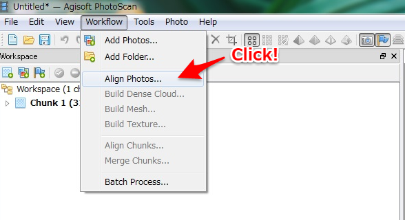
Accuracy:Low
Pair preselection:Refrence (画像データに位置情報がついている場合、ない場合はGeneric)
クリックOK
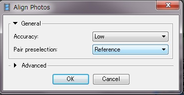

## 3. GCP setting
GCP settingの前にメッシュモデルを作成する。メッシュモデルを作成することにより複数の画像に移っているGCPを一斉に選択することができる。  
Workflow→Build Mesh  
クリックOK
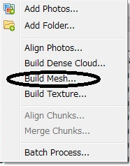

画像データよりGCPをsettingする。
ToolbarのReferenceを表示させる。（Toolbar上で左クリックRefrence選択）
Toolbar上のEdit Markersをクリック。
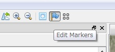

Refrenceより画像を選択して画像上のGCPを置いた点で 右クリック→Create Markerクリック。

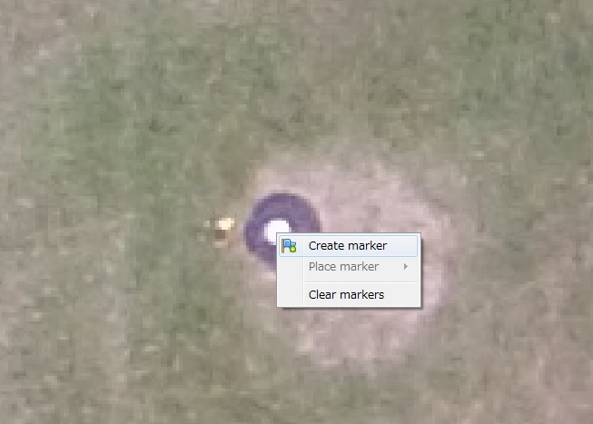

Markersが作られているかRefrenceで確認。
わかりやすい名前にMarkersを変更。

ReferenceよりImportをクリック。
位置情報のテキストファイルをImport。**（ダブルクリックで直接入力もできる、、、。こちらでテキストファイルを用意する場合、Importのほうがミスはないかも？）**

各Markerが正しい点におかれているか確認する。
左クリック→Filter Photos by Markers
Photosのタブで確認、ずれている場合はドラッグして修正。

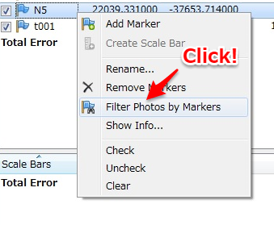

Settingをクリック。座標系を確認。
今回は日本測地系第９系(JGD2000/Japan Plane Rectangular CS Ⅸ)

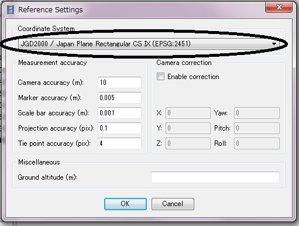

RefrenceのタブでCamerasのチェックをすべて外す。Camerasの位置情報を使わない状態にする。

Optimize Camerasをクリック。
クリックＯＫ。

## 4.Build dense cloud
Workflow→Build Dense Cloud

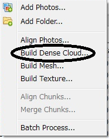

Quality:Low
クリックOK

## 5. Build mesh
Workflow→Build Mesh

Surface type:Height field
Source data:Dense cloud
でクリックOK。

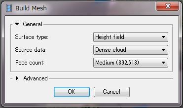

## 6. export to DEM, orthophoto,LAS

orthophotoの精度をあげるためBuild textureを行います。
Workflow→Build Texture

クリックOK。

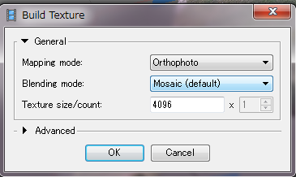

Chunk 1で右クリックExport→Export Orthophoto→Export JPEG/TIFF/PNGをクリック

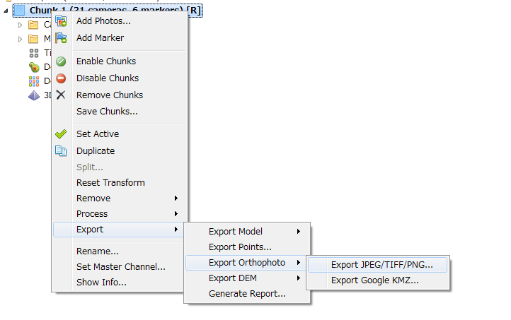

座標系等を確認しクリックOK。

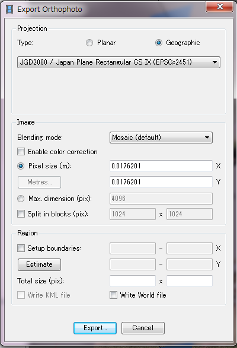

名前を設定し、TIFFで保存。
Chunk 1→Export→Export DEM→Export TIFF/BIL/XYZをクリック。

座標系等を確認、Crop invaild DEMにチェックを入れる。
クリックOK。

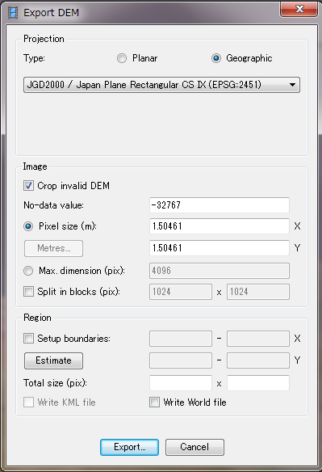

Geo TIFF Elevation Dataで保存、名前を設定して保存。

Chunk1→Export→Export Points

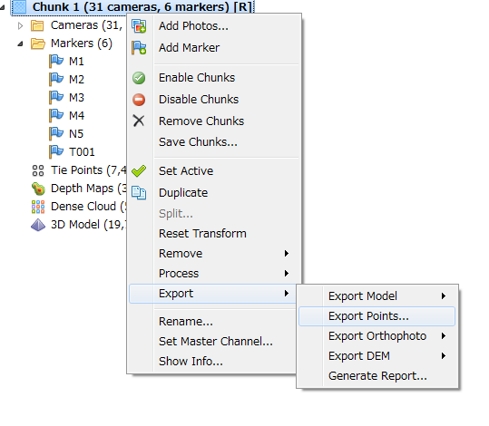

ファイル名を指定、ファイルの種類をASPRS LAS(.las)で保存。

座標系を指定、Point colorsにチェックを入れる。
クリックOK。

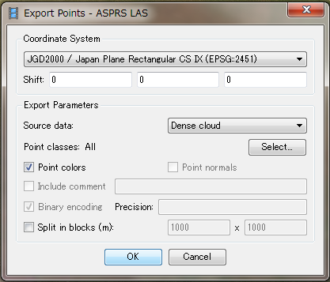
