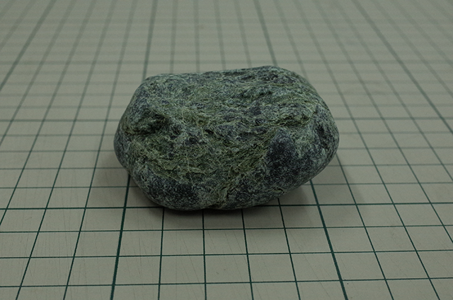
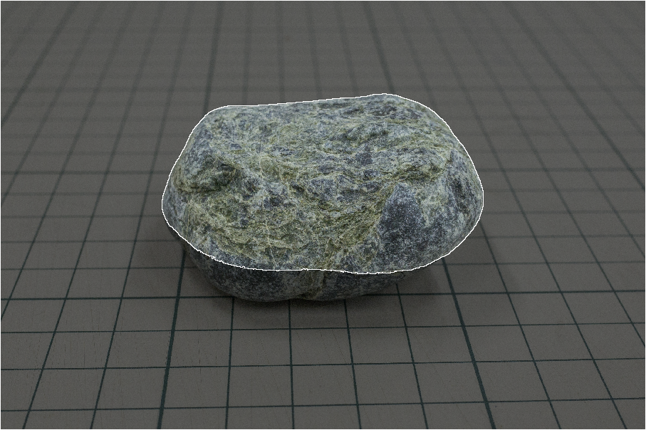
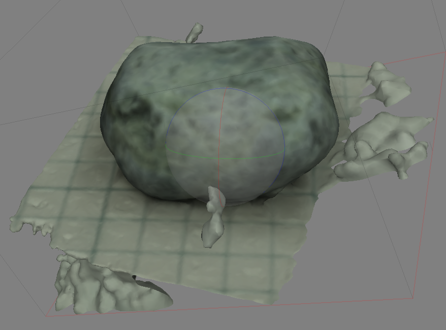
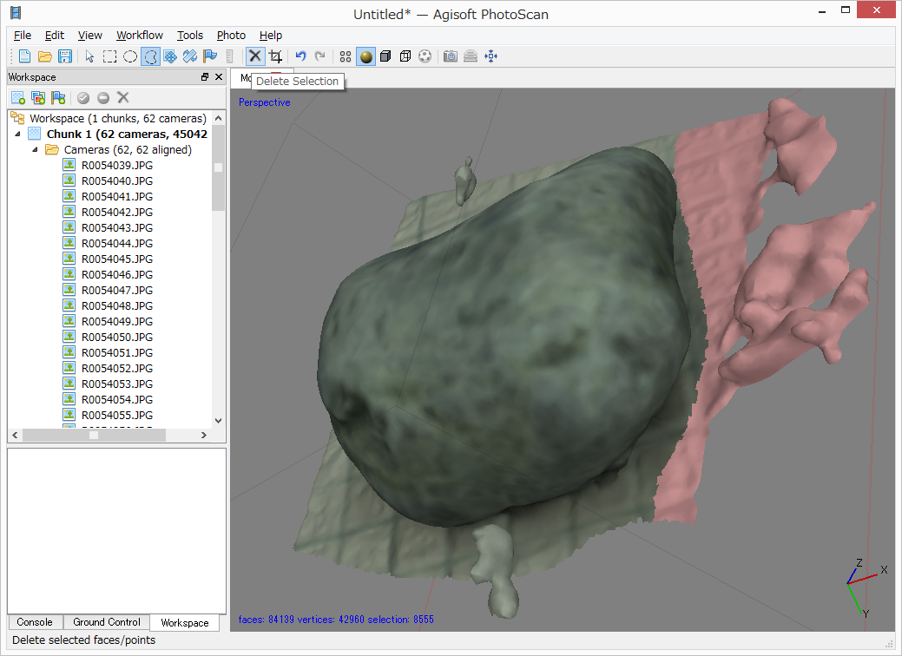
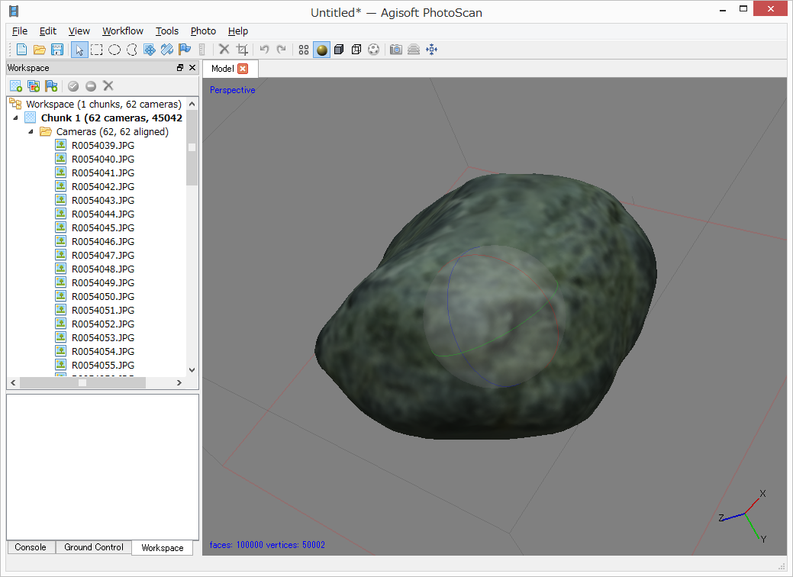

# 10.	Mask処理
　写真測量のソース画像には、モデル化する際に不必要な部分が含まれる（Fig9.1）。この場合、不必要な領域にMaskを作成することで、モデルの生成対象から外すことができる（Fig.9.2）。しかし、通常の作業では100枚を超える写真をソースとして利用する。これらすべての写真に対し、手動でマスク生成作業を行うのはとても現実的ではない。そこで、簡易な方法で効率よくMaskを生成する手法を解説する。  
　なお、この手法はArbitraryなモデルに限らず、Height fieldで処理するモデルに対しても有効である（例：黒い枠のある航空写真の黒枠の内側だけを処理する場合）。  

  
Fig.10.1 ソース画像。背景の方眼模様はモデル化の際に不必要な領域。  

  
Fig.10.2 ソース画像に対しMaskを適用した例。薄く黒く塗りつぶされている領域がMask。Maskされた領域はモデル生成の計算に使われない。  

## 1) まずは初回のBuild Meshまでの処理を行う。
---
　最終的なモデルを作るわけではないので、Build Dense cloudのQualityは低く（Lowest）、Build MeshのFace countは少なく（Low）の設定で処理する。

  
Fig.10.3 初回のBuild Meshが完了した直後。不必要な領域やゴミがモデル化されている。

## 2)	モデル化しなくてよい領域などを削除し、整形する。
---

  
Fig.10.4 モデル化しなくてよい領域を削除する。ツールバーの「Free-Form selection」ツールなどで不必要な領域を選択し、「Delete Selection」ボタンを押して削除する作業を行う。

## 3)	整形したモデルからMaskを自動生成する。「Tools」-「Import」-「Import masks…」を選択する（Fig.9.5）。
---
　以下の設定を行い、OKを押すとMaskが自動生成される。

  
Fig.10.5 Import Maskウィンドウ。  
Import masks for：「Active chunks」を選択する。複数のChunkがある場合は注意する。Workspaceで黒太文字になっているChunkがActive chunk。  
Method：「From Model」を選択。

## 4)	再度、Build Geometry処理を実施すると、Maskした領域が無視されるため、よりキレイなモデルが生成される（Fig.10.6）。
---
  
Fig.10.6 Maskが適用されたために、不必要な領域やゴミがモデル化されなくなった。  

## 5)	必要に応じて2)～4)の工程を繰り返す。
---

## 6)	ゴミや不必要領域がなくなったら、よりQualityが高く、Faceの多いモデルを計算する。
---

　Photosペインの「Show masks」ボタンをクリックすると、ソースの写真画像に適用されたMaskを一覧で確認できる（Fig.10.7）。

  
Fig.10.7 Photosウィンドウから「Show masks」ボタンをクリックした様子  
黒がMask。白が三次元モデルの計算対象領域
