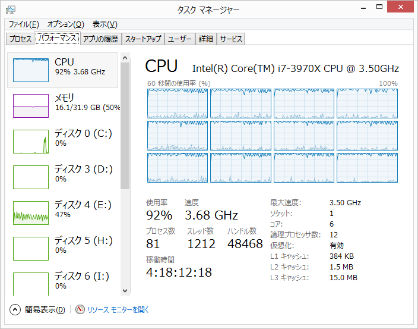
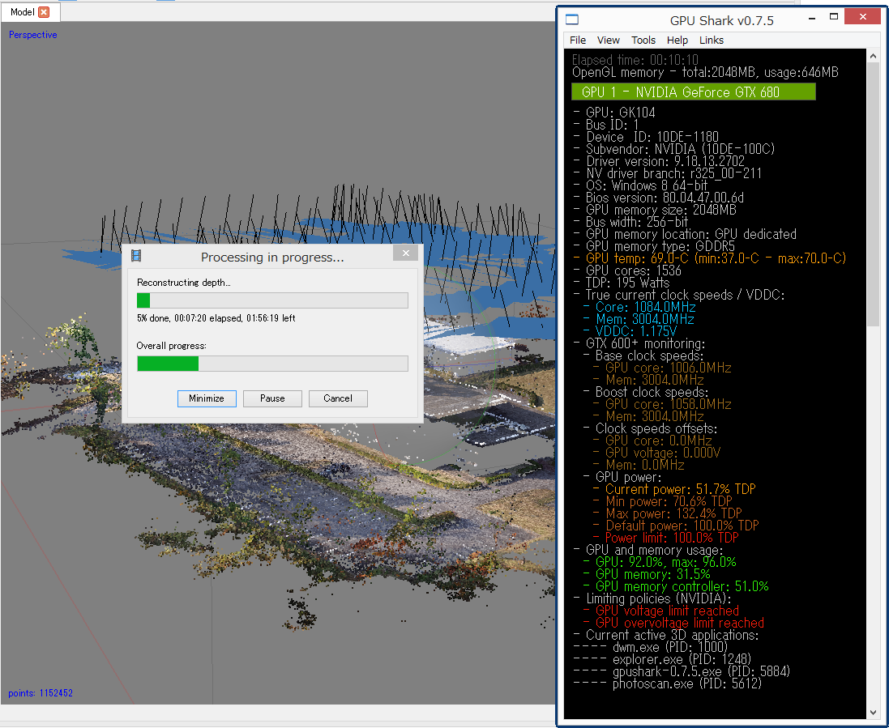

# 4.	ハードウェア
　写真測量の精度を高めるには、大量の写真を精密に組み合わせ、視差を計算し、対象物の表面形状を高密度な3Dポリゴン（Face）で埋め尽くした三次元モデルを構築する必要がある。結局のところ、最終成果品として高精度な3DモデルやDSMを限られた時間内に生成するためには、膨大な計算リソースが必要となる。

## 4.1	CPU
---
　PhotoScanはマルチスレッド対応のため、OSが認識するすべてのCPUコアを100%使用して計算を行うことができる（Fig.3.1）。最新のアーキテクチャ、高いクロック速度、多くの物理コアを持つCPUが望ましい。  
また、GPUを計算に利用する場合、GPUボード1基につきGPU管理のためにCPU物理コアが1つ（HT有効の場合2つ）必要となる。複数のGPUボードを持つ計算機の場合、PhotoScanの計算に使えるCPUリソースが減少するため、CPUのマルチソケット構成が必要になるだろう。

## 4.2	CPUのハイパースレッディング（HT）
---
　以下の環境におけるテストではHT有効のほうが概ね約20%程度、高速であった。ただしXeon CPUの場合、HT無効のほうが高速という報告もある。いずれにせよ、各自の環境でテストを行うことを推奨する。  
- テスト環境：
  - CPU: Core i7 Extreme 3970X（Sandy Bridge, 6 Cores, 3.5-4.0GHz）
  - 写真枚数：62枚  
- 結果：ハイパースレッディング有効
  - Align Photos: 434.439 sec.（24.7%高速）
  - Build Geometry: 198.227 sec. + 69.128 sec.（19.5%高速）
  - Build Texture: 74.003 sec.（8.7%低速）
- 結果：ハイパースレッディング無効
  - Align Photos: 541.912 sec.
  - Build Geometry: 248.151 sec. + 71.253 sec.
  - Build Texture: 67.549 sec.

## 4.3	GPU
---
　PhotoScanはOpenCL対応のGPUを計算リソースとして利用することができる（Fig.3.2）。GPUは、CPU（コア数2～6個）と比してコア数（例：nVidia GeForce GTX680の場合、GPUコアは1536個）が非常に多いため、科学技術計算のような単純計算であればCPUの数倍から百数十倍のスピードで計算を行うことができる。以下の環境におけるテストでは、GPUを有効にすることにより約3倍、高速であった。これを活用しない手はない。  
- テスト環境：nVidia GeForce GTX680、Core i7 Extreme 3970X（HT有効）
  - 結果：GPU有効  
    Reconstruction Depth: 2h 02min 18sec（約3倍高速）
  - 結果：GPU無効  
    Reconstruction Depth: 5h 53min 36sec

## 4.4	物理メモリ
---
　物理メモリは、多ければ多いほど良い。処理する写真画像の枚数や処理メソッドによるが、本格的に利用するのであれば最低でも32GBは必要であろう。特に、建物などの三次元オブジェクトを処理するArbitrary modeでは膨大なメモリが必要になる。以下に、必要な物理メモリの目安を掲載する。

### Aligning Photos処理：  
|Photos|100|200|500|1000|2000|5000|10000|
|:---:|:---:|:---:|:---:|:---:|:---:|:---:|:---:|
|**Memory consumption**|**500 MB**|**1 GB**|**2.5 GB**|**5 GB**|**10 GB**|**25 GB**|**50 GB**|

### Building Model (Height-field mode)処理：
|Photos|100|200|500|1000|2000|5000|10000|
|:---:|:---:|:---:|:---:|:---:|:---:|:---:|:---:|
|**Lowest quality**|**25 MB**|**50 MB**|**125 MB**|**250 MB**|**500 MB**|**1.25 GB**|**2.5 GB**|
|**Low quality**|**100 MB**|**200 MB**|**500 MB**|**1 GB**|**2 GB**|**5 GB**|**10 GB**|
|**Medium quality**|**400 MB**|**800 MB**|**2 GB**|**4 GB**|**8 GB**|**20 GB**|**40 GB**|
|**High quality**|**1.6 GB**|**3.2 GB**|**8 GB**|**16 GB**|**32 GB**|**80 GB**|**160 GB**|
|**Ultra high quality**|**6.4 GB**|**12.8 GB**|**32 GB**|**64GB**|**128 GB**|**320 GB**|**640 GB**|

### Building Model (Arbitrary mode)処理：
|Photos|20 - 50|100|200|500|
|:---:|:---:|:---:|:---:|:---:|
|**Lowest quality**|**100 MB - 300 MB**|**150 MB - 450 MB**|**300 MB - 1 GB**|**1 GB - 3 GB**|
|**Low quality**|**500 MB - 1.5 GB**|**750 MB - 2.2 GB**|**1.5 GB - 4.5 GB**|**4 GB - 12 GB**|
|**Medium quality**|**2 GB - 6 GB**|**3 GB - 9 GB**|**6 GB - 18 GB**|**15 GB - 45 GB**|
|**High quality**|**8 GB - 24 GB**|**12GB - 36 GB**|**24 GB - 72 GB**|**60 GB - 180 GB**|
|**Ultra high quality**|**32 GB - 96 GB**|**48 GB - 144 GB**|**96 GB - 288 GB**|**240 GB - 720 GB**|

### Decimating Model処理：
|Faces (millions)|1|5|10|20|50|100|200|500|
|:---:|:---:|:---:|:---:|:---:|:---:|:---:|:---:|:---:|
|**Memory consumption**|**128 MB**|**640 MB**|**1.3 GB**|**2.5 GB**|**6.2 GB**|**12.5 GB**|**25 GB**|**63 GB**|

  
Fig.4.1 Generating Mesh処理中のCPU利用率。PhotoScanはマルチスレッド対応アプリケーションのため、計算機に搭載する全CPUコアを使い切る。

  
Fig.4.2 Reconstruction Depth処理にGPUを利用している状態。GPUを使用しない場合に比して約3倍高速であった。（GPUコア数1536個、GPU使用率96%（最大値）、nVidia GeForce GTX680の例）
